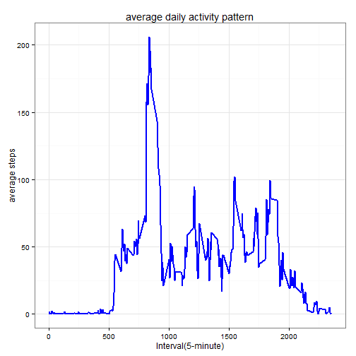
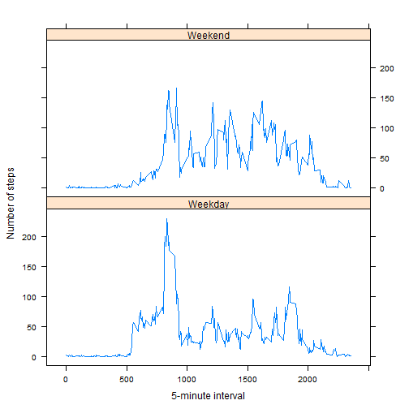

## Loading and preprocessing the data

```r
#Load the data (i.e. read.csv())
#Process/transform the data (if necessary) into a format suitable for your analysis

#set current working directory to the directory where the data file is before start runing the code
#preprocessing data will be done separately according to the requirement of the following questions
library (knitr)
data<-read.csv("activity.csv")
head(data)
```

```
##   steps       date interval
## 1    NA 2012-10-01        0
## 2    NA 2012-10-01        5
## 3    NA 2012-10-01       10
## 4    NA 2012-10-01       15
## 5    NA 2012-10-01       20
## 6    NA 2012-10-01       25
```

## What is mean total number of steps taken per day?

```r
#For this part of the assignment, you can ignore the missing values in the dataset.
#Calculate the 'Total-Number-Of-Steps-Taken-Per-Day'
#Make a histogram of the total number of steps taken each day
#Calculate and report the mean and median of the 'Total-Number-Of-Steps-Taken-Per-Day'
data_no_NA<-data[complete.cases(data),] 

attach(data_no_NA)
sum_steps_day<-aggregate(data_no_NA$steps, by=list(date), FUN=sum)
detach(data_no_NA)
names(sum_steps_day)<-c("date","steps")
head(sum_steps_day) 
```

```
##         date steps
## 1 2012-10-02   126
## 2 2012-10-03 11352
## 3 2012-10-04 12116
## 4 2012-10-05 13294
## 5 2012-10-06 15420
## 6 2012-10-07 11015
```

```r
library(ggplot2)
#binwidth can be adjusted by setting 'geom_histogram(binwidth = x)', where x is a value
ggplot(sum_steps_day, aes(x=steps)) + geom_histogram()
```

 

```r
mean_steps_day<-mean(sum_steps_day$steps)
median_steps_day<-median(sum_steps_day$steps)
```
The mean of the 'Total-Number-Of-Steps-Taken-Per-Day' is  10766.19  
The median of the 'Total-Number-Of-Steps-Taken-Per-Day' is  10765


## What is the average daily activity pattern?

```r
#Make a time series plot (i.e. type = "l") of the 5-minute interval (x-axis) and the average number of steps taken, averaged across all days (y-axis)
#Which 5-minute interval, on average across all the days in the dataset, contains the maximum number of steps?
attach(data_no_NA)
avg_daily<-aggregate(data_no_NA$steps, by=list(interval), FUN=mean)
detach(data_no_NA)
names(avg_daily)<-c("interval","avg_steps")
head(avg_daily) 
```

```
##   interval avg_steps
## 1        0 1.7169811
## 2        5 0.3396226
## 3       10 0.1320755
## 4       15 0.1509434
## 5       20 0.0754717
## 6       25 2.0943396
```

```r
#type "l" or lines plot
ggplot(avg_daily, aes(x=interval, y=avg_steps)) + geom_line(color="blue",size=1)+
  labs(title="average daily activity pattern", x="Interval(5-minute)", y="average steps")+
  theme_bw()
```

 

```r
max_interval<-avg_daily[which.max(avg_daily$avg_steps),]
max_interval
```

```
##     interval avg_steps
## 104      835  206.1698
```
The 5-minute interval with maximum number of steps is at interval of 835


## Imputing missing values

```r
#Calculate and report the total number of missing values in the dataset (i.e. the total number of rows with NAs)
num_of_NA<-sum(is.na(data))
num_of_NA
```

```
## [1] 2304
```
There are 2304 rows with NA in the original dataset.


```r
#Devise a strategy for filling in all of the missing values in the dataset. The strategy does not need to be sophisticated. For example, you could use the mean/median for that day, or the mean for that 5-minute interval, etc.
#Create a new dataset that is equal to the original dataset but with the missing data filled in.

##strategy= we can either replace the NA with zero value or substitute with the mean value of the same range (5-mnute interval or day). I will proceed with replace NA with mean value of the same 5-minute interval range
#create new dataset
new_data<-data
#identify position for NA in logical TRUE or FALSE
NAs<-is.na(new_data$steps)
#find mean of the 5-minute interval while ignoring NA value in the new dataset
avg_5minute_interval<-tapply(new_data$steps,new_data$interval,mean,na.rm=TRUE, simplify=TRUE)
#replace the NA value in the "steps" column with the average value for the corresponding 5-minute interval
new_data$steps[NAs]<-avg_5minute_interval[as.character(new_data$interval[NAs])]
#verify no more NA in the new dataset
sum(is.na(new_data$steps))
```

```
## [1] 0
```

```r
head(new_data)
```

```
##       steps       date interval
## 1 1.7169811 2012-10-01        0
## 2 0.3396226 2012-10-01        5
## 3 0.1320755 2012-10-01       10
## 4 0.1509434 2012-10-01       15
## 5 0.0754717 2012-10-01       20
## 6 2.0943396 2012-10-01       25
```


```r
#Make a histogram of the total number of steps taken each day and Calculate and report the mean and median total number of steps taken per day. Do these values differ from the estimates from the first part of the assignment? What is the impact of imputing missing data on the estimates of the total daily number of steps?

#histogram for total number of steps taken each day
attach(new_data)
sum_steps_day_newdata<-aggregate(new_data$steps, by=list(date), FUN=sum)
detach(new_data)
names(sum_steps_day_newdata)<-c("date","steps")

library(ggplot2)
ggplot(sum_steps_day_newdata, aes(x=steps)) + geom_histogram()
```

 

```r
mean_steps_day_newdata<-mean(sum_steps_day_newdata$steps)
median_steps_day_newdata<-median(sum_steps_day_newdata$steps)
```
The mean of 'Total-Number-Of-Steps-Taken-Per-Day' is 10766.19  
The median of 'Total-Number-Of-Steps-Taken-Per-Day' is 10766.19

Answer:  
1)We can see that the histogram is similar for data without NA and imputing missing data except at the middle of the histogram, where it has more count for data with imputing missing data which is obvious since we "add" more data by subtitute NA with mean value.  
2)The "mean value" doesn't differ from the value estimates from first part of the assignment, this is due to NA values were replaced with the mean value calculated from the data with NA ignored. However, for the "median value",  it shifted slightly to bigger value.  
3)Generally, imputing missing data will not impact or cause much changes to the output provided the missing data is imputed reasonably.  


## Are there differences in activity patterns between weekdays and weekends?

```r
#Create a new factor variable in the dataset with two levels - "weekday" and "weekend" indicating whether a given date is a weekday or weekend day.
new_data$date<-weekdays(as.Date(new_data$date))
new_data$DayType<-factor(new_data$date)
levels(new_data$DayType)<-list(
    Weekday=c("Monday","Tuesday","Wednesday","Thursday","Friday"), 
    Weekend=c("Saturday","Sunday")
    )
new_data
```

```
##             steps      date interval DayType
## 1       1.7169811    Monday        0 Weekday
## 2       0.3396226    Monday        5 Weekday
## 3       0.1320755    Monday       10 Weekday
## 4       0.1509434    Monday       15 Weekday
## 5       0.0754717    Monday       20 Weekday
## 6       2.0943396    Monday       25 Weekday
## 7       0.5283019    Monday       30 Weekday
## 8       0.8679245    Monday       35 Weekday
## 9       0.0000000    Monday       40 Weekday
## 10      1.4716981    Monday       45 Weekday
## 11      0.3018868    Monday       50 Weekday
## 12      0.1320755    Monday       55 Weekday
## 13      0.3207547    Monday      100 Weekday
## 14      0.6792453    Monday      105 Weekday
## 15      0.1509434    Monday      110 Weekday
## 16      0.3396226    Monday      115 Weekday
## 17      0.0000000    Monday      120 Weekday
## 18      1.1132075    Monday      125 Weekday
## 19      1.8301887    Monday      130 Weekday
## 20      0.1698113    Monday      135 Weekday
## 21      0.1698113    Monday      140 Weekday
## 22      0.3773585    Monday      145 Weekday
## 23      0.2641509    Monday      150 Weekday
## 24      0.0000000    Monday      155 Weekday
## 25      0.0000000    Monday      200 Weekday
## 26      0.0000000    Monday      205 Weekday
## 27      1.1320755    Monday      210 Weekday
## 28      0.0000000    Monday      215 Weekday
## 29      0.0000000    Monday      220 Weekday
## 30      0.1320755    Monday      225 Weekday
## 31      0.0000000    Monday      230 Weekday
## 32      0.2264151    Monday      235 Weekday
## 33      0.0000000    Monday      240 Weekday
## 34      0.0000000    Monday      245 Weekday
## 35      1.5471698    Monday      250 Weekday
## 36      0.9433962    Monday      255 Weekday
## 37      0.0000000    Monday      300 Weekday
## 38      0.0000000    Monday      305 Weekday
## 39      0.0000000    Monday      310 Weekday
## 40      0.0000000    Monday      315 Weekday
## 41      0.2075472    Monday      320 Weekday
## 42      0.6226415    Monday      325 Weekday
## 43      1.6226415    Monday      330 Weekday
## 44      0.5849057    Monday      335 Weekday
## 45      0.4905660    Monday      340 Weekday
## 46      0.0754717    Monday      345 Weekday
## 47      0.0000000    Monday      350 Weekday
## 48      0.0000000    Monday      355 Weekday
## 49      1.1886792    Monday      400 Weekday
## 50      0.9433962    Monday      405 Weekday
## 51      2.5660377    Monday      410 Weekday
## 52      0.0000000    Monday      415 Weekday
## 53      0.3396226    Monday      420 Weekday
## 54      0.3584906    Monday      425 Weekday
## 55      4.1132075    Monday      430 Weekday
## 56      0.6603774    Monday      435 Weekday
## 57      3.4905660    Monday      440 Weekday
## 58      0.8301887    Monday      445 Weekday
## 59      3.1132075    Monday      450 Weekday
## 60      1.1132075    Monday      455 Weekday
## 61      0.0000000    Monday      500 Weekday
## 62      1.5660377    Monday      505 Weekday
## 63      3.0000000    Monday      510 Weekday
## 64      2.2452830    Monday      515 Weekday
## 65      3.3207547    Monday      520 Weekday
## 66      2.9622642    Monday      525 Weekday
## 67      2.0943396    Monday      530 Weekday
## 68      6.0566038    Monday      535 Weekday
## 69     16.0188679    Monday      540 Weekday
## 70     18.3396226    Monday      545 Weekday
## 71     39.4528302    Monday      550 Weekday
## 72     44.4905660    Monday      555 Weekday
## 73     31.4905660    Monday      600 Weekday
## 74     49.2641509    Monday      605 Weekday
## 75     53.7735849    Monday      610 Weekday
## 76     63.4528302    Monday      615 Weekday
## 77     49.9622642    Monday      620 Weekday
## 78     47.0754717    Monday      625 Weekday
## 79     52.1509434    Monday      630 Weekday
## 80     39.3396226    Monday      635 Weekday
## 81     44.0188679    Monday      640 Weekday
## 82     44.1698113    Monday      645 Weekday
## 83     37.3584906    Monday      650 Weekday
## 84     49.0377358    Monday      655 Weekday
## 85     43.8113208    Monday      700 Weekday
## 86     44.3773585    Monday      705 Weekday
## 87     50.5094340    Monday      710 Weekday
## 88     54.5094340    Monday      715 Weekday
## 89     49.9245283    Monday      720 Weekday
## 90     50.9811321    Monday      725 Weekday
## 91     55.6792453    Monday      730 Weekday
## 92     44.3207547    Monday      735 Weekday
## 93     52.2641509    Monday      740 Weekday
## 94     69.5471698    Monday      745 Weekday
## 95     57.8490566    Monday      750 Weekday
## 96     56.1509434    Monday      755 Weekday
## 97     73.3773585    Monday      800 Weekday
## 98     68.2075472    Monday      805 Weekday
## 99    129.4339623    Monday      810 Weekday
## 100   157.5283019    Monday      815 Weekday
## 101   171.1509434    Monday      820 Weekday
## 102   155.3962264    Monday      825 Weekday
## 103   177.3018868    Monday      830 Weekday
## 104   206.1698113    Monday      835 Weekday
## 105   195.9245283    Monday      840 Weekday
## 106   179.5660377    Monday      845 Weekday
## 107   183.3962264    Monday      850 Weekday
## 108   167.0188679    Monday      855 Weekday
## 109   143.4528302    Monday      900 Weekday
## 110   124.0377358    Monday      905 Weekday
## 111   109.1132075    Monday      910 Weekday
## 112   108.1132075    Monday      915 Weekday
## 113   103.7169811    Monday      920 Weekday
## 114    95.9622642    Monday      925 Weekday
## 115    66.2075472    Monday      930 Weekday
## 116    45.2264151    Monday      935 Weekday
## 117    24.7924528    Monday      940 Weekday
## 118    38.7547170    Monday      945 Weekday
## 119    34.9811321    Monday      950 Weekday
## 120    21.0566038    Monday      955 Weekday
## 121    40.5660377    Monday     1000 Weekday
## 122    26.9811321    Monday     1005 Weekday
## 123    42.4150943    Monday     1010 Weekday
## 124    52.6603774    Monday     1015 Weekday
## 125    38.9245283    Monday     1020 Weekday
## 126    50.7924528    Monday     1025 Weekday
## 127    44.2830189    Monday     1030 Weekday
## 128    37.4150943    Monday     1035 Weekday
## 129    34.6981132    Monday     1040 Weekday
## 130    28.3396226    Monday     1045 Weekday
## 131    25.0943396    Monday     1050 Weekday
## 132    31.9433962    Monday     1055 Weekday
## 133    31.3584906    Monday     1100 Weekday
## 134    29.6792453    Monday     1105 Weekday
## 135    21.3207547    Monday     1110 Weekday
## 136    25.5471698    Monday     1115 Weekday
## 137    28.3773585    Monday     1120 Weekday
## 138    26.4716981    Monday     1125 Weekday
## 139    33.4339623    Monday     1130 Weekday
## 140    49.9811321    Monday     1135 Weekday
## 141    42.0377358    Monday     1140 Weekday
## 142    44.6037736    Monday     1145 Weekday
## 143    46.0377358    Monday     1150 Weekday
## 144    59.1886792    Monday     1155 Weekday
## 145    63.8679245    Monday     1200 Weekday
## 146    87.6981132    Monday     1205 Weekday
## 147    94.8490566    Monday     1210 Weekday
## 148    92.7735849    Monday     1215 Weekday
## 149    63.3962264    Monday     1220 Weekday
## 150    50.1698113    Monday     1225 Weekday
## 151    54.4716981    Monday     1230 Weekday
## 152    32.4150943    Monday     1235 Weekday
## 153    26.5283019    Monday     1240 Weekday
## 154    37.7358491    Monday     1245 Weekday
## 155    45.0566038    Monday     1250 Weekday
## 156    67.2830189    Monday     1255 Weekday
## 157    42.3396226    Monday     1300 Weekday
## 158    39.8867925    Monday     1305 Weekday
## 159    43.2641509    Monday     1310 Weekday
## 160    40.9811321    Monday     1315 Weekday
## 161    46.2452830    Monday     1320 Weekday
## 162    56.4339623    Monday     1325 Weekday
## 163    42.7547170    Monday     1330 Weekday
## 164    25.1320755    Monday     1335 Weekday
## 165    39.9622642    Monday     1340 Weekday
## 166    53.5471698    Monday     1345 Weekday
## 167    47.3207547    Monday     1350 Weekday
## 168    60.8113208    Monday     1355 Weekday
## 169    55.7547170    Monday     1400 Weekday
## 170    51.9622642    Monday     1405 Weekday
## 171    43.5849057    Monday     1410 Weekday
## 172    48.6981132    Monday     1415 Weekday
## 173    35.4716981    Monday     1420 Weekday
## 174    37.5471698    Monday     1425 Weekday
## 175    41.8490566    Monday     1430 Weekday
## 176    27.5094340    Monday     1435 Weekday
## 177    17.1132075    Monday     1440 Weekday
## 178    26.0754717    Monday     1445 Weekday
## 179    43.6226415    Monday     1450 Weekday
## 180    43.7735849    Monday     1455 Weekday
## 181    30.0188679    Monday     1500 Weekday
## 182    36.0754717    Monday     1505 Weekday
## 183    35.4905660    Monday     1510 Weekday
## 184    38.8490566    Monday     1515 Weekday
## 185    45.9622642    Monday     1520 Weekday
## 186    47.7547170    Monday     1525 Weekday
## 187    48.1320755    Monday     1530 Weekday
## 188    65.3207547    Monday     1535 Weekday
## 189    82.9056604    Monday     1540 Weekday
## 190    98.6603774    Monday     1545 Weekday
## 191   102.1132075    Monday     1550 Weekday
## 192    83.9622642    Monday     1555 Weekday
## 193    62.1320755    Monday     1600 Weekday
## 194    64.1320755    Monday     1605 Weekday
## 195    74.5471698    Monday     1610 Weekday
## 196    63.1698113    Monday     1615 Weekday
## 197    56.9056604    Monday     1620 Weekday
## 198    59.7735849    Monday     1625 Weekday
## 199    43.8679245    Monday     1630 Weekday
## 200    38.5660377    Monday     1635 Weekday
## 201    44.6603774    Monday     1640 Weekday
## 202    45.4528302    Monday     1645 Weekday
## 203    46.2075472    Monday     1650 Weekday
## 204    43.6792453    Monday     1655 Weekday
## 205    46.6226415    Monday     1700 Weekday
## 206    56.3018868    Monday     1705 Weekday
## 207    50.7169811    Monday     1710 Weekday
## 208    61.2264151    Monday     1715 Weekday
## 209    72.7169811    Monday     1720 Weekday
## 210    78.9433962    Monday     1725 Weekday
## 211    68.9433962    Monday     1730 Weekday
## 212    59.6603774    Monday     1735 Weekday
## 213    75.0943396    Monday     1740 Weekday
## 214    56.5094340    Monday     1745 Weekday
## 215    34.7735849    Monday     1750 Weekday
## 216    37.4528302    Monday     1755 Weekday
## 217    40.6792453    Monday     1800 Weekday
## 218    58.0188679    Monday     1805 Weekday
## 219    74.6981132    Monday     1810 Weekday
## 220    85.3207547    Monday     1815 Weekday
## 221    59.2641509    Monday     1820 Weekday
## 222    67.7735849    Monday     1825 Weekday
## 223    77.6981132    Monday     1830 Weekday
## 224    74.2452830    Monday     1835 Weekday
## 225    85.3396226    Monday     1840 Weekday
## 226    99.4528302    Monday     1845 Weekday
## 227    86.5849057    Monday     1850 Weekday
## 228    85.6037736    Monday     1855 Weekday
## 229    84.8679245    Monday     1900 Weekday
## 230    77.8301887    Monday     1905 Weekday
## 231    58.0377358    Monday     1910 Weekday
## 232    53.3584906    Monday     1915 Weekday
## 233    36.3207547    Monday     1920 Weekday
## 234    20.7169811    Monday     1925 Weekday
## 235    27.3962264    Monday     1930 Weekday
## 236    40.0188679    Monday     1935 Weekday
## 237    30.2075472    Monday     1940 Weekday
## 238    25.5471698    Monday     1945 Weekday
## 239    45.6603774    Monday     1950 Weekday
## 240    33.5283019    Monday     1955 Weekday
## 241    19.6226415    Monday     2000 Weekday
## 242    19.0188679    Monday     2005 Weekday
## 243    19.3396226    Monday     2010 Weekday
## 244    33.3396226    Monday     2015 Weekday
## 245    26.8113208    Monday     2020 Weekday
## 246    21.1698113    Monday     2025 Weekday
## 247    27.3018868    Monday     2030 Weekday
## 248    21.3396226    Monday     2035 Weekday
## 249    19.5471698    Monday     2040 Weekday
## 250    21.3207547    Monday     2045 Weekday
## 251    32.3018868    Monday     2050 Weekday
## 252    20.1509434    Monday     2055 Weekday
## 253    15.9433962    Monday     2100 Weekday
## 254    17.2264151    Monday     2105 Weekday
## 255    23.4528302    Monday     2110 Weekday
## 256    19.2452830    Monday     2115 Weekday
## 257    12.4528302    Monday     2120 Weekday
## 258     8.0188679    Monday     2125 Weekday
## 259    14.6603774    Monday     2130 Weekday
## 260    16.3018868    Monday     2135 Weekday
## 261     8.6792453    Monday     2140 Weekday
## 262     7.7924528    Monday     2145 Weekday
## 263     8.1320755    Monday     2150 Weekday
## 264     2.6226415    Monday     2155 Weekday
## 265     1.4528302    Monday     2200 Weekday
## 266     3.6792453    Monday     2205 Weekday
## 267     4.8113208    Monday     2210 Weekday
## 268     8.5094340    Monday     2215 Weekday
## 269     7.0754717    Monday     2220 Weekday
## 270     8.6981132    Monday     2225 Weekday
## 271     9.7547170    Monday     2230 Weekday
## 272     2.2075472    Monday     2235 Weekday
## 273     0.3207547    Monday     2240 Weekday
## 274     0.1132075    Monday     2245 Weekday
## 275     1.6037736    Monday     2250 Weekday
## 276     4.6037736    Monday     2255 Weekday
## 277     3.3018868    Monday     2300 Weekday
## 278     2.8490566    Monday     2305 Weekday
## 279     0.0000000    Monday     2310 Weekday
## 280     0.8301887    Monday     2315 Weekday
## 281     0.9622642    Monday     2320 Weekday
## 282     1.5849057    Monday     2325 Weekday
## 283     2.6037736    Monday     2330 Weekday
## 284     4.6981132    Monday     2335 Weekday
## 285     3.3018868    Monday     2340 Weekday
## 286     0.6415094    Monday     2345 Weekday
## 287     0.2264151    Monday     2350 Weekday
## 288     1.0754717    Monday     2355 Weekday
## 289     0.0000000   Tuesday        0 Weekday
## 290     0.0000000   Tuesday        5 Weekday
## 291     0.0000000   Tuesday       10 Weekday
## 292     0.0000000   Tuesday       15 Weekday
## 293     0.0000000   Tuesday       20 Weekday
## 294     0.0000000   Tuesday       25 Weekday
## 295     0.0000000   Tuesday       30 Weekday
## 296     0.0000000   Tuesday       35 Weekday
## 297     0.0000000   Tuesday       40 Weekday
## 298     0.0000000   Tuesday       45 Weekday
## 299     0.0000000   Tuesday       50 Weekday
## 300     0.0000000   Tuesday       55 Weekday
## 301     0.0000000   Tuesday      100 Weekday
## 302     0.0000000   Tuesday      105 Weekday
## 303     0.0000000   Tuesday      110 Weekday
## 304     0.0000000   Tuesday      115 Weekday
## 305     0.0000000   Tuesday      120 Weekday
## 306     0.0000000   Tuesday      125 Weekday
## 307     0.0000000   Tuesday      130 Weekday
## 308     0.0000000   Tuesday      135 Weekday
## 309     0.0000000   Tuesday      140 Weekday
## 310     0.0000000   Tuesday      145 Weekday
## 311     0.0000000   Tuesday      150 Weekday
## 312     0.0000000   Tuesday      155 Weekday
## 313     0.0000000   Tuesday      200 Weekday
## 314     0.0000000   Tuesday      205 Weekday
## 315     0.0000000   Tuesday      210 Weekday
## 316     0.0000000   Tuesday      215 Weekday
## 317     0.0000000   Tuesday      220 Weekday
## 318     0.0000000   Tuesday      225 Weekday
## 319     0.0000000   Tuesday      230 Weekday
## 320     0.0000000   Tuesday      235 Weekday
## 321     0.0000000   Tuesday      240 Weekday
## 322     0.0000000   Tuesday      245 Weekday
## 323     0.0000000   Tuesday      250 Weekday
## 324     0.0000000   Tuesday      255 Weekday
## 325     0.0000000   Tuesday      300 Weekday
## 326     0.0000000   Tuesday      305 Weekday
## 327     0.0000000   Tuesday      310 Weekday
## 328     0.0000000   Tuesday      315 Weekday
## 329     0.0000000   Tuesday      320 Weekday
## 330     0.0000000   Tuesday      325 Weekday
## 331     0.0000000   Tuesday      330 Weekday
## 332     0.0000000   Tuesday      335 Weekday
## 333     0.0000000   Tuesday      340 Weekday
## 334     0.0000000   Tuesday      345 Weekday
## 335     0.0000000   Tuesday      350 Weekday
## 336     0.0000000   Tuesday      355 Weekday
## 337     0.0000000   Tuesday      400 Weekday
## 338     0.0000000   Tuesday      405 Weekday
## 339     0.0000000   Tuesday      410 Weekday
## 340     0.0000000   Tuesday      415 Weekday
## 341     0.0000000   Tuesday      420 Weekday
## 342     0.0000000   Tuesday      425 Weekday
## 343     0.0000000   Tuesday      430 Weekday
## 344     0.0000000   Tuesday      435 Weekday
## 345     0.0000000   Tuesday      440 Weekday
## 346     0.0000000   Tuesday      445 Weekday
## 347     0.0000000   Tuesday      450 Weekday
## 348     0.0000000   Tuesday      455 Weekday
## 349     0.0000000   Tuesday      500 Weekday
## 350     0.0000000   Tuesday      505 Weekday
## 351     0.0000000   Tuesday      510 Weekday
## 352     0.0000000   Tuesday      515 Weekday
## 353     0.0000000   Tuesday      520 Weekday
## 354     0.0000000   Tuesday      525 Weekday
## 355     0.0000000   Tuesday      530 Weekday
## 356     0.0000000   Tuesday      535 Weekday
## 357     0.0000000   Tuesday      540 Weekday
## 358     0.0000000   Tuesday      545 Weekday
## 359     0.0000000   Tuesday      550 Weekday
## 360     0.0000000   Tuesday      555 Weekday
## 361     0.0000000   Tuesday      600 Weekday
## 362     0.0000000   Tuesday      605 Weekday
## 363     0.0000000   Tuesday      610 Weekday
## 364     0.0000000   Tuesday      615 Weekday
## 365     0.0000000   Tuesday      620 Weekday
## 366     0.0000000   Tuesday      625 Weekday
## 367     0.0000000   Tuesday      630 Weekday
## 368     0.0000000   Tuesday      635 Weekday
## 369     0.0000000   Tuesday      640 Weekday
## 370     0.0000000   Tuesday      645 Weekday
## 371     0.0000000   Tuesday      650 Weekday
## 372     0.0000000   Tuesday      655 Weekday
## 373     0.0000000   Tuesday      700 Weekday
## 374     0.0000000   Tuesday      705 Weekday
## 375     0.0000000   Tuesday      710 Weekday
## 376     0.0000000   Tuesday      715 Weekday
## 377     0.0000000   Tuesday      720 Weekday
## 378     0.0000000   Tuesday      725 Weekday
## 379     0.0000000   Tuesday      730 Weekday
## 380     0.0000000   Tuesday      735 Weekday
## 381     0.0000000   Tuesday      740 Weekday
## 382     0.0000000   Tuesday      745 Weekday
## 383     0.0000000   Tuesday      750 Weekday
## 384     0.0000000   Tuesday      755 Weekday
## 385     0.0000000   Tuesday      800 Weekday
## 386     0.0000000   Tuesday      805 Weekday
## 387     0.0000000   Tuesday      810 Weekday
## 388     0.0000000   Tuesday      815 Weekday
## 389     0.0000000   Tuesday      820 Weekday
## 390     0.0000000   Tuesday      825 Weekday
## 391     0.0000000   Tuesday      830 Weekday
## 392     0.0000000   Tuesday      835 Weekday
## 393     0.0000000   Tuesday      840 Weekday
## 394     0.0000000   Tuesday      845 Weekday
## 395     0.0000000   Tuesday      850 Weekday
## 396     0.0000000   Tuesday      855 Weekday
## 397     0.0000000   Tuesday      900 Weekday
## 398     0.0000000   Tuesday      905 Weekday
## 399     0.0000000   Tuesday      910 Weekday
## 400     0.0000000   Tuesday      915 Weekday
## 401     0.0000000   Tuesday      920 Weekday
## 402     0.0000000   Tuesday      925 Weekday
## 403     0.0000000   Tuesday      930 Weekday
## 404     0.0000000   Tuesday      935 Weekday
## 405     0.0000000   Tuesday      940 Weekday
## 406     0.0000000   Tuesday      945 Weekday
## 407     0.0000000   Tuesday      950 Weekday
## 408     0.0000000   Tuesday      955 Weekday
## 409     0.0000000   Tuesday     1000 Weekday
## 410     0.0000000   Tuesday     1005 Weekday
## 411     0.0000000   Tuesday     1010 Weekday
## 412     0.0000000   Tuesday     1015 Weekday
## 413     0.0000000   Tuesday     1020 Weekday
## 414     0.0000000   Tuesday     1025 Weekday
## 415     0.0000000   Tuesday     1030 Weekday
## 416     0.0000000   Tuesday     1035 Weekday
## 417     0.0000000   Tuesday     1040 Weekday
## 418     0.0000000   Tuesday     1045 Weekday
## 419     0.0000000   Tuesday     1050 Weekday
## 420     0.0000000   Tuesday     1055 Weekday
## 421     0.0000000   Tuesday     1100 Weekday
## 422     0.0000000   Tuesday     1105 Weekday
## 423     0.0000000   Tuesday     1110 Weekday
## 424     0.0000000   Tuesday     1115 Weekday
## 425     0.0000000   Tuesday     1120 Weekday
## 426     0.0000000   Tuesday     1125 Weekday
## 427     0.0000000   Tuesday     1130 Weekday
## 428     0.0000000   Tuesday     1135 Weekday
## 429     0.0000000   Tuesday     1140 Weekday
## 430     0.0000000   Tuesday     1145 Weekday
## 431     0.0000000   Tuesday     1150 Weekday
## 432     0.0000000   Tuesday     1155 Weekday
## 433     0.0000000   Tuesday     1200 Weekday
## 434     0.0000000   Tuesday     1205 Weekday
## 435     0.0000000   Tuesday     1210 Weekday
## 436     0.0000000   Tuesday     1215 Weekday
## 437     0.0000000   Tuesday     1220 Weekday
## 438     0.0000000   Tuesday     1225 Weekday
## 439     0.0000000   Tuesday     1230 Weekday
## 440     0.0000000   Tuesday     1235 Weekday
## 441     0.0000000   Tuesday     1240 Weekday
## 442     0.0000000   Tuesday     1245 Weekday
## 443     0.0000000   Tuesday     1250 Weekday
## 444     0.0000000   Tuesday     1255 Weekday
## 445     0.0000000   Tuesday     1300 Weekday
## 446     0.0000000   Tuesday     1305 Weekday
## 447     0.0000000   Tuesday     1310 Weekday
## 448     0.0000000   Tuesday     1315 Weekday
## 449     0.0000000   Tuesday     1320 Weekday
## 450     0.0000000   Tuesday     1325 Weekday
## 451     0.0000000   Tuesday     1330 Weekday
## 452     0.0000000   Tuesday     1335 Weekday
## 453     0.0000000   Tuesday     1340 Weekday
## 454     0.0000000   Tuesday     1345 Weekday
## 455     0.0000000   Tuesday     1350 Weekday
## 456     0.0000000   Tuesday     1355 Weekday
## 457     0.0000000   Tuesday     1400 Weekday
## 458     0.0000000   Tuesday     1405 Weekday
## 459     0.0000000   Tuesday     1410 Weekday
## 460     0.0000000   Tuesday     1415 Weekday
## 461     0.0000000   Tuesday     1420 Weekday
## 462     0.0000000   Tuesday     1425 Weekday
## 463     0.0000000   Tuesday     1430 Weekday
## 464     0.0000000   Tuesday     1435 Weekday
## 465     0.0000000   Tuesday     1440 Weekday
## 466     0.0000000   Tuesday     1445 Weekday
## 467     0.0000000   Tuesday     1450 Weekday
## 468     0.0000000   Tuesday     1455 Weekday
## 469     0.0000000   Tuesday     1500 Weekday
## 470     0.0000000   Tuesday     1505 Weekday
## 471     0.0000000   Tuesday     1510 Weekday
## 472     0.0000000   Tuesday     1515 Weekday
## 473     0.0000000   Tuesday     1520 Weekday
## 474     0.0000000   Tuesday     1525 Weekday
## 475     0.0000000   Tuesday     1530 Weekday
## 476     0.0000000   Tuesday     1535 Weekday
## 477     0.0000000   Tuesday     1540 Weekday
## 478     0.0000000   Tuesday     1545 Weekday
## 479     0.0000000   Tuesday     1550 Weekday
## 480     0.0000000   Tuesday     1555 Weekday
## 481     0.0000000   Tuesday     1600 Weekday
## 482     0.0000000   Tuesday     1605 Weekday
## 483     0.0000000   Tuesday     1610 Weekday
## 484     0.0000000   Tuesday     1615 Weekday
## 485     0.0000000   Tuesday     1620 Weekday
## 486     0.0000000   Tuesday     1625 Weekday
## 487     0.0000000   Tuesday     1630 Weekday
## 488     0.0000000   Tuesday     1635 Weekday
## 489     0.0000000   Tuesday     1640 Weekday
## 490     0.0000000   Tuesday     1645 Weekday
## 491     0.0000000   Tuesday     1650 Weekday
## 492     0.0000000   Tuesday     1655 Weekday
## 493     0.0000000   Tuesday     1700 Weekday
## 494     0.0000000   Tuesday     1705 Weekday
## 495     0.0000000   Tuesday     1710 Weekday
## 496     0.0000000   Tuesday     1715 Weekday
## 497     0.0000000   Tuesday     1720 Weekday
## 498     0.0000000   Tuesday     1725 Weekday
## 499     0.0000000   Tuesday     1730 Weekday
## 500     0.0000000   Tuesday     1735 Weekday
## 501     0.0000000   Tuesday     1740 Weekday
## 502     0.0000000   Tuesday     1745 Weekday
## 503     0.0000000   Tuesday     1750 Weekday
## 504     0.0000000   Tuesday     1755 Weekday
## 505     0.0000000   Tuesday     1800 Weekday
## 506     0.0000000   Tuesday     1805 Weekday
## 507     0.0000000   Tuesday     1810 Weekday
## 508     0.0000000   Tuesday     1815 Weekday
## 509     0.0000000   Tuesday     1820 Weekday
## 510     0.0000000   Tuesday     1825 Weekday
## 511     0.0000000   Tuesday     1830 Weekday
## 512     0.0000000   Tuesday     1835 Weekday
## 513     0.0000000   Tuesday     1840 Weekday
## 514     0.0000000   Tuesday     1845 Weekday
## 515     0.0000000   Tuesday     1850 Weekday
## 516     0.0000000   Tuesday     1855 Weekday
## 517     0.0000000   Tuesday     1900 Weekday
## 518     0.0000000   Tuesday     1905 Weekday
## 519     0.0000000   Tuesday     1910 Weekday
## 520     0.0000000   Tuesday     1915 Weekday
## 521     0.0000000   Tuesday     1920 Weekday
## 522     0.0000000   Tuesday     1925 Weekday
## 523     0.0000000   Tuesday     1930 Weekday
## 524     0.0000000   Tuesday     1935 Weekday
## 525     0.0000000   Tuesday     1940 Weekday
## 526     0.0000000   Tuesday     1945 Weekday
## 527     0.0000000   Tuesday     1950 Weekday
## 528     0.0000000   Tuesday     1955 Weekday
## 529     0.0000000   Tuesday     2000 Weekday
## 530     0.0000000   Tuesday     2005 Weekday
## 531     0.0000000   Tuesday     2010 Weekday
## 532     0.0000000   Tuesday     2015 Weekday
## 533     0.0000000   Tuesday     2020 Weekday
## 534     0.0000000   Tuesday     2025 Weekday
## 535     0.0000000   Tuesday     2030 Weekday
## 536     0.0000000   Tuesday     2035 Weekday
## 537     0.0000000   Tuesday     2040 Weekday
## 538     0.0000000   Tuesday     2045 Weekday
## 539     0.0000000   Tuesday     2050 Weekday
## 540     0.0000000   Tuesday     2055 Weekday
## 541     0.0000000   Tuesday     2100 Weekday
## 542     0.0000000   Tuesday     2105 Weekday
## 543     0.0000000   Tuesday     2110 Weekday
## 544     0.0000000   Tuesday     2115 Weekday
## 545     0.0000000   Tuesday     2120 Weekday
## 546     0.0000000   Tuesday     2125 Weekday
## 547     0.0000000   Tuesday     2130 Weekday
## 548     0.0000000   Tuesday     2135 Weekday
## 549     0.0000000   Tuesday     2140 Weekday
## 550     0.0000000   Tuesday     2145 Weekday
## 551     0.0000000   Tuesday     2150 Weekday
## 552     0.0000000   Tuesday     2155 Weekday
## 553     0.0000000   Tuesday     2200 Weekday
## 554     0.0000000   Tuesday     2205 Weekday
## 555   117.0000000   Tuesday     2210 Weekday
## 556     9.0000000   Tuesday     2215 Weekday
## 557     0.0000000   Tuesday     2220 Weekday
## 558     0.0000000   Tuesday     2225 Weekday
## 559     0.0000000   Tuesday     2230 Weekday
## 560     0.0000000   Tuesday     2235 Weekday
## 561     0.0000000   Tuesday     2240 Weekday
## 562     0.0000000   Tuesday     2245 Weekday
## 563     0.0000000   Tuesday     2250 Weekday
## 564     0.0000000   Tuesday     2255 Weekday
## 565     0.0000000   Tuesday     2300 Weekday
## 566     0.0000000   Tuesday     2305 Weekday
## 567     0.0000000   Tuesday     2310 Weekday
## 568     0.0000000   Tuesday     2315 Weekday
## 569     0.0000000   Tuesday     2320 Weekday
## 570     0.0000000   Tuesday     2325 Weekday
## 571     0.0000000   Tuesday     2330 Weekday
## 572     0.0000000   Tuesday     2335 Weekday
## 573     0.0000000   Tuesday     2340 Weekday
## 574     0.0000000   Tuesday     2345 Weekday
## 575     0.0000000   Tuesday     2350 Weekday
## 576     0.0000000   Tuesday     2355 Weekday
## 577     0.0000000 Wednesday        0 Weekday
## 578     0.0000000 Wednesday        5 Weekday
## 579     0.0000000 Wednesday       10 Weekday
## 580     0.0000000 Wednesday       15 Weekday
## 581     0.0000000 Wednesday       20 Weekday
## 582     0.0000000 Wednesday       25 Weekday
## 583     0.0000000 Wednesday       30 Weekday
## 584     0.0000000 Wednesday       35 Weekday
## 585     0.0000000 Wednesday       40 Weekday
## 586     0.0000000 Wednesday       45 Weekday
## 587     0.0000000 Wednesday       50 Weekday
## 588     0.0000000 Wednesday       55 Weekday
## 589     0.0000000 Wednesday      100 Weekday
## 590     0.0000000 Wednesday      105 Weekday
## 591     0.0000000 Wednesday      110 Weekday
## 592     0.0000000 Wednesday      115 Weekday
## 593     0.0000000 Wednesday      120 Weekday
## 594     0.0000000 Wednesday      125 Weekday
## 595     0.0000000 Wednesday      130 Weekday
## 596     0.0000000 Wednesday      135 Weekday
## 597     0.0000000 Wednesday      140 Weekday
## 598     0.0000000 Wednesday      145 Weekday
## 599     0.0000000 Wednesday      150 Weekday
## 600     0.0000000 Wednesday      155 Weekday
## 601     0.0000000 Wednesday      200 Weekday
## 602     0.0000000 Wednesday      205 Weekday
## 603     0.0000000 Wednesday      210 Weekday
## 604     0.0000000 Wednesday      215 Weekday
## 605     0.0000000 Wednesday      220 Weekday
## 606     0.0000000 Wednesday      225 Weekday
## 607     0.0000000 Wednesday      230 Weekday
## 608     0.0000000 Wednesday      235 Weekday
## 609     0.0000000 Wednesday      240 Weekday
## 610     0.0000000 Wednesday      245 Weekday
## 611     0.0000000 Wednesday      250 Weekday
## 612     0.0000000 Wednesday      255 Weekday
## 613     0.0000000 Wednesday      300 Weekday
## 614     0.0000000 Wednesday      305 Weekday
## 615     0.0000000 Wednesday      310 Weekday
## 616     0.0000000 Wednesday      315 Weekday
## 617     0.0000000 Wednesday      320 Weekday
## 618     0.0000000 Wednesday      325 Weekday
## 619     0.0000000 Wednesday      330 Weekday
## 620     0.0000000 Wednesday      335 Weekday
## 621     0.0000000 Wednesday      340 Weekday
## 622     0.0000000 Wednesday      345 Weekday
## 623     0.0000000 Wednesday      350 Weekday
## 624     0.0000000 Wednesday      355 Weekday
## 625     0.0000000 Wednesday      400 Weekday
## 626     0.0000000 Wednesday      405 Weekday
## 627     4.0000000 Wednesday      410 Weekday
## 628     0.0000000 Wednesday      415 Weekday
## 629     0.0000000 Wednesday      420 Weekday
## 630     0.0000000 Wednesday      425 Weekday
## 631    36.0000000 Wednesday      430 Weekday
## 632     0.0000000 Wednesday      435 Weekday
## 633     0.0000000 Wednesday      440 Weekday
## 634     0.0000000 Wednesday      445 Weekday
## 635     0.0000000 Wednesday      450 Weekday
## 636     0.0000000 Wednesday      455 Weekday
## 637     0.0000000 Wednesday      500 Weekday
## 638     0.0000000 Wednesday      505 Weekday
## 639     0.0000000 Wednesday      510 Weekday
## 640     0.0000000 Wednesday      515 Weekday
## 641     0.0000000 Wednesday      520 Weekday
## 642     0.0000000 Wednesday      525 Weekday
## 643     0.0000000 Wednesday      530 Weekday
## 644    25.0000000 Wednesday      535 Weekday
## 645     0.0000000 Wednesday      540 Weekday
## 646     0.0000000 Wednesday      545 Weekday
## 647    90.0000000 Wednesday      550 Weekday
## 648   411.0000000 Wednesday      555 Weekday
## 649   413.0000000 Wednesday      600 Weekday
## 650   415.0000000 Wednesday      605 Weekday
## 651   519.0000000 Wednesday      610 Weekday
## 652   529.0000000 Wednesday      615 Weekday
## 653   613.0000000 Wednesday      620 Weekday
## 654   562.0000000 Wednesday      625 Weekday
## 655   612.0000000 Wednesday      630 Weekday
## 656   534.0000000 Wednesday      635 Weekday
## 657   323.0000000 Wednesday      640 Weekday
## 658   600.0000000 Wednesday      645 Weekday
## 659   533.0000000 Wednesday      650 Weekday
## 660   251.0000000 Wednesday      655 Weekday
## 661    56.0000000 Wednesday      700 Weekday
## 662     0.0000000 Wednesday      705 Weekday
## 663    32.0000000 Wednesday      710 Weekday
## 664    80.0000000 Wednesday      715 Weekday
## 665    10.0000000 Wednesday      720 Weekday
## 666     9.0000000 Wednesday      725 Weekday
## 667   145.0000000 Wednesday      730 Weekday
## 668    46.0000000 Wednesday      735 Weekday
## 669     0.0000000 Wednesday      740 Weekday
## 670    44.0000000 Wednesday      745 Weekday
## 671   126.0000000 Wednesday      750 Weekday
## 672    42.0000000 Wednesday      755 Weekday
## 673   138.0000000 Wednesday      800 Weekday
## 674    53.0000000 Wednesday      805 Weekday
## 675     0.0000000 Wednesday      810 Weekday
## 676     0.0000000 Wednesday      815 Weekday
## 677    22.0000000 Wednesday      820 Weekday
## 678    57.0000000 Wednesday      825 Weekday
## 679   161.0000000 Wednesday      830 Weekday
## 680    19.0000000 Wednesday      835 Weekday
## 681    15.0000000 Wednesday      840 Weekday
## 682     0.0000000 Wednesday      845 Weekday
## 683    16.0000000 Wednesday      850 Weekday
## 684     0.0000000 Wednesday      855 Weekday
## 685     0.0000000 Wednesday      900 Weekday
## 686     8.0000000 Wednesday      905 Weekday
## 687     0.0000000 Wednesday      910 Weekday
## 688    51.0000000 Wednesday      915 Weekday
## 689   516.0000000 Wednesday      920 Weekday
## 690   245.0000000 Wednesday      925 Weekday
## 691     0.0000000 Wednesday      930 Weekday
## 692   161.0000000 Wednesday      935 Weekday
## 693     7.0000000 Wednesday      940 Weekday
## 694     0.0000000 Wednesday      945 Weekday
## 695     0.0000000 Wednesday      950 Weekday
## 696     0.0000000 Wednesday      955 Weekday
## 697     0.0000000 Wednesday     1000 Weekday
## 698     0.0000000 Wednesday     1005 Weekday
## 699     0.0000000 Wednesday     1010 Weekday
## 700     0.0000000 Wednesday     1015 Weekday
## 701     0.0000000 Wednesday     1020 Weekday
## 702     0.0000000 Wednesday     1025 Weekday
## 703     0.0000000 Wednesday     1030 Weekday
## 704     0.0000000 Wednesday     1035 Weekday
## 705     0.0000000 Wednesday     1040 Weekday
## 706     0.0000000 Wednesday     1045 Weekday
## 707     0.0000000 Wednesday     1050 Weekday
## 708     0.0000000 Wednesday     1055 Weekday
## 709     0.0000000 Wednesday     1100 Weekday
## 710     0.0000000 Wednesday     1105 Weekday
## 711     0.0000000 Wednesday     1110 Weekday
## 712     0.0000000 Wednesday     1115 Weekday
## 713     0.0000000 Wednesday     1120 Weekday
## 714     0.0000000 Wednesday     1125 Weekday
## 715     0.0000000 Wednesday     1130 Weekday
## 716    72.0000000 Wednesday     1135 Weekday
## 717    73.0000000 Wednesday     1140 Weekday
## 718     0.0000000 Wednesday     1145 Weekday
## 719     0.0000000 Wednesday     1150 Weekday
## 720   116.0000000 Wednesday     1155 Weekday
## 721    97.0000000 Wednesday     1200 Weekday
## 722     0.0000000 Wednesday     1205 Weekday
## 723     0.0000000 Wednesday     1210 Weekday
## 724     0.0000000 Wednesday     1215 Weekday
## 725     0.0000000 Wednesday     1220 Weekday
## 726     0.0000000 Wednesday     1225 Weekday
## 727    15.0000000 Wednesday     1230 Weekday
## 728     0.0000000 Wednesday     1235 Weekday
## 729     0.0000000 Wednesday     1240 Weekday
## 730     0.0000000 Wednesday     1245 Weekday
## 731     0.0000000 Wednesday     1250 Weekday
## 732     0.0000000 Wednesday     1255 Weekday
## 733    80.0000000 Wednesday     1300 Weekday
## 734    69.0000000 Wednesday     1305 Weekday
## 735     0.0000000 Wednesday     1310 Weekday
## 736     0.0000000 Wednesday     1315 Weekday
## 737     0.0000000 Wednesday     1320 Weekday
## 738     0.0000000 Wednesday     1325 Weekday
## 739     0.0000000 Wednesday     1330 Weekday
## 740     0.0000000 Wednesday     1335 Weekday
## 741     0.0000000 Wednesday     1340 Weekday
## 742    99.0000000 Wednesday     1345 Weekday
## 743   100.0000000 Wednesday     1350 Weekday
## 744     0.0000000 Wednesday     1355 Weekday
## 745     0.0000000 Wednesday     1400 Weekday
## 746    33.0000000 Wednesday     1405 Weekday
## 747     0.0000000 Wednesday     1410 Weekday
## 748     0.0000000 Wednesday     1415 Weekday
## 749     7.0000000 Wednesday     1420 Weekday
## 750     0.0000000 Wednesday     1425 Weekday
## 751     0.0000000 Wednesday     1430 Weekday
## 752     0.0000000 Wednesday     1435 Weekday
## 753     0.0000000 Wednesday     1440 Weekday
## 754     0.0000000 Wednesday     1445 Weekday
## 755     0.0000000 Wednesday     1450 Weekday
## 756     0.0000000 Wednesday     1455 Weekday
## 757     0.0000000 Wednesday     1500 Weekday
## 758     0.0000000 Wednesday     1505 Weekday
## 759     0.0000000 Wednesday     1510 Weekday
## 760     0.0000000 Wednesday     1515 Weekday
## 761     0.0000000 Wednesday     1520 Weekday
## 762     0.0000000 Wednesday     1525 Weekday
## 763     0.0000000 Wednesday     1530 Weekday
## 764     0.0000000 Wednesday     1535 Weekday
## 765     0.0000000 Wednesday     1540 Weekday
## 766    88.0000000 Wednesday     1545 Weekday
## 767   154.0000000 Wednesday     1550 Weekday
## 768     0.0000000 Wednesday     1555 Weekday
## 769    20.0000000 Wednesday     1600 Weekday
## 770     0.0000000 Wednesday     1605 Weekday
## 771     0.0000000 Wednesday     1610 Weekday
## 772     0.0000000 Wednesday     1615 Weekday
## 773     0.0000000 Wednesday     1620 Weekday
## 774     0.0000000 Wednesday     1625 Weekday
## 775     0.0000000 Wednesday     1630 Weekday
## 776     0.0000000 Wednesday     1635 Weekday
## 777     0.0000000 Wednesday     1640 Weekday
## 778     0.0000000 Wednesday     1645 Weekday
## 779     0.0000000 Wednesday     1650 Weekday
## 780     0.0000000 Wednesday     1655 Weekday
## 781     0.0000000 Wednesday     1700 Weekday
## 782     0.0000000 Wednesday     1705 Weekday
## 783   198.0000000 Wednesday     1710 Weekday
## 784    61.0000000 Wednesday     1715 Weekday
## 785    75.0000000 Wednesday     1720 Weekday
## 786     0.0000000 Wednesday     1725 Weekday
## 787     0.0000000 Wednesday     1730 Weekday
## 788   193.0000000 Wednesday     1735 Weekday
## 789   298.0000000 Wednesday     1740 Weekday
## 790     0.0000000 Wednesday     1745 Weekday
## 791    15.0000000 Wednesday     1750 Weekday
## 792    21.0000000 Wednesday     1755 Weekday
## 793     0.0000000 Wednesday     1800 Weekday
## 794     0.0000000 Wednesday     1805 Weekday
## 795     0.0000000 Wednesday     1810 Weekday
## 796     0.0000000 Wednesday     1815 Weekday
## 797    51.0000000 Wednesday     1820 Weekday
## 798    36.0000000 Wednesday     1825 Weekday
## 799     0.0000000 Wednesday     1830 Weekday
## 800    26.0000000 Wednesday     1835 Weekday
## 801    22.0000000 Wednesday     1840 Weekday
## 802     0.0000000 Wednesday     1845 Weekday
## 803    39.0000000 Wednesday     1850 Weekday
## 804    52.0000000 Wednesday     1855 Weekday
## 805    15.0000000 Wednesday     1900 Weekday
## 806    41.0000000 Wednesday     1905 Weekday
## 807     0.0000000 Wednesday     1910 Weekday
## 808    42.0000000 Wednesday     1915 Weekday
## 809     0.0000000 Wednesday     1920 Weekday
## 810     0.0000000 Wednesday     1925 Weekday
## 811   159.0000000 Wednesday     1930 Weekday
## 812    32.0000000 Wednesday     1935 Weekday
## 813     0.0000000 Wednesday     1940 Weekday
## 814     0.0000000 Wednesday     1945 Weekday
## 815     0.0000000 Wednesday     1950 Weekday
## 816     0.0000000 Wednesday     1955 Weekday
## 817    34.0000000 Wednesday     2000 Weekday
## 818     0.0000000 Wednesday     2005 Weekday
## 819     0.0000000 Wednesday     2010 Weekday
## 820     0.0000000 Wednesday     2015 Weekday
## 821     0.0000000 Wednesday     2020 Weekday
## 822    36.0000000 Wednesday     2025 Weekday
## 823    73.0000000 Wednesday     2030 Weekday
## 824     9.0000000 Wednesday     2035 Weekday
## 825     0.0000000 Wednesday     2040 Weekday
## 826     0.0000000 Wednesday     2045 Weekday
## 827     0.0000000 Wednesday     2050 Weekday
## 828     0.0000000 Wednesday     2055 Weekday
## 829     0.0000000 Wednesday     2100 Weekday
## 830     0.0000000 Wednesday     2105 Weekday
## 831     0.0000000 Wednesday     2110 Weekday
## 832     0.0000000 Wednesday     2115 Weekday
## 833     0.0000000 Wednesday     2120 Weekday
## 834     0.0000000 Wednesday     2125 Weekday
## 835    90.0000000 Wednesday     2130 Weekday
## 836   128.0000000 Wednesday     2135 Weekday
## 837    46.0000000 Wednesday     2140 Weekday
## 838     0.0000000 Wednesday     2145 Weekday
## 839     0.0000000 Wednesday     2150 Weekday
## 840     0.0000000 Wednesday     2155 Weekday
## 841     0.0000000 Wednesday     2200 Weekday
## 842     0.0000000 Wednesday     2205 Weekday
## 843     0.0000000 Wednesday     2210 Weekday
## 844     0.0000000 Wednesday     2215 Weekday
## 845     0.0000000 Wednesday     2220 Weekday
## 846     0.0000000 Wednesday     2225 Weekday
## 847     0.0000000 Wednesday     2230 Weekday
## 848     0.0000000 Wednesday     2235 Weekday
## 849     0.0000000 Wednesday     2240 Weekday
## 850     0.0000000 Wednesday     2245 Weekday
## 851     0.0000000 Wednesday     2250 Weekday
## 852     0.0000000 Wednesday     2255 Weekday
## 853     0.0000000 Wednesday     2300 Weekday
## 854     0.0000000 Wednesday     2305 Weekday
## 855     0.0000000 Wednesday     2310 Weekday
## 856     0.0000000 Wednesday     2315 Weekday
## 857     0.0000000 Wednesday     2320 Weekday
## 858     0.0000000 Wednesday     2325 Weekday
## 859     0.0000000 Wednesday     2330 Weekday
## 860     0.0000000 Wednesday     2335 Weekday
## 861     0.0000000 Wednesday     2340 Weekday
## 862     8.0000000 Wednesday     2345 Weekday
## 863     0.0000000 Wednesday     2350 Weekday
## 864     0.0000000 Wednesday     2355 Weekday
## 865    47.0000000  Thursday        0 Weekday
## 866     0.0000000  Thursday        5 Weekday
## 867     0.0000000  Thursday       10 Weekday
## 868     0.0000000  Thursday       15 Weekday
## 869     0.0000000  Thursday       20 Weekday
## 870     0.0000000  Thursday       25 Weekday
## 871     0.0000000  Thursday       30 Weekday
## 872     0.0000000  Thursday       35 Weekday
## 873     0.0000000  Thursday       40 Weekday
## 874     0.0000000  Thursday       45 Weekday
## 875     0.0000000  Thursday       50 Weekday
## 876     0.0000000  Thursday       55 Weekday
## 877     0.0000000  Thursday      100 Weekday
## 878     0.0000000  Thursday      105 Weekday
## 879     0.0000000  Thursday      110 Weekday
## 880     0.0000000  Thursday      115 Weekday
## 881     0.0000000  Thursday      120 Weekday
## 882     0.0000000  Thursday      125 Weekday
## 883     0.0000000  Thursday      130 Weekday
## 884     0.0000000  Thursday      135 Weekday
## 885     0.0000000  Thursday      140 Weekday
## 886     0.0000000  Thursday      145 Weekday
## 887     0.0000000  Thursday      150 Weekday
## 888     0.0000000  Thursday      155 Weekday
## 889     0.0000000  Thursday      200 Weekday
## 890     0.0000000  Thursday      205 Weekday
## 891     0.0000000  Thursday      210 Weekday
## 892     0.0000000  Thursday      215 Weekday
## 893     0.0000000  Thursday      220 Weekday
## 894     0.0000000  Thursday      225 Weekday
## 895     0.0000000  Thursday      230 Weekday
## 896     0.0000000  Thursday      235 Weekday
## 897     0.0000000  Thursday      240 Weekday
## 898     0.0000000  Thursday      245 Weekday
## 899     0.0000000  Thursday      250 Weekday
## 900     0.0000000  Thursday      255 Weekday
## 901     0.0000000  Thursday      300 Weekday
## 902     0.0000000  Thursday      305 Weekday
## 903     0.0000000  Thursday      310 Weekday
## 904     0.0000000  Thursday      315 Weekday
## 905     0.0000000  Thursday      320 Weekday
## 906     0.0000000  Thursday      325 Weekday
## 907     0.0000000  Thursday      330 Weekday
## 908     0.0000000  Thursday      335 Weekday
## 909     0.0000000  Thursday      340 Weekday
## 910     0.0000000  Thursday      345 Weekday
## 911     0.0000000  Thursday      350 Weekday
## 912     0.0000000  Thursday      355 Weekday
## 913     0.0000000  Thursday      400 Weekday
## 914     0.0000000  Thursday      405 Weekday
## 915     0.0000000  Thursday      410 Weekday
## 916     0.0000000  Thursday      415 Weekday
## 917     0.0000000  Thursday      420 Weekday
## 918     0.0000000  Thursday      425 Weekday
## 919     0.0000000  Thursday      430 Weekday
## 920     0.0000000  Thursday      435 Weekday
## 921     0.0000000  Thursday      440 Weekday
## 922     0.0000000  Thursday      445 Weekday
## 923     0.0000000  Thursday      450 Weekday
## 924     0.0000000  Thursday      455 Weekday
## 925     0.0000000  Thursday      500 Weekday
## 926     0.0000000  Thursday      505 Weekday
## 927     7.0000000  Thursday      510 Weekday
## 928    18.0000000  Thursday      515 Weekday
## 929    57.0000000  Thursday      520 Weekday
## 930    40.0000000  Thursday      525 Weekday
## 931     0.0000000  Thursday      530 Weekday
## 932     0.0000000  Thursday      535 Weekday
## 933     0.0000000  Thursday      540 Weekday
## 934     0.0000000  Thursday      545 Weekday
## 935    16.0000000  Thursday      550 Weekday
## 936     1.0000000  Thursday      555 Weekday
## 937     0.0000000  Thursday      600 Weekday
## 938    18.0000000  Thursday      605 Weekday
## 939    20.0000000  Thursday      610 Weekday
## 940    40.0000000  Thursday      615 Weekday
## 941    36.0000000  Thursday      620 Weekday
## 942    17.0000000  Thursday      625 Weekday
## 943    49.0000000  Thursday      630 Weekday
## 944    86.0000000  Thursday      635 Weekday
## 945    49.0000000  Thursday      640 Weekday
## 946     0.0000000  Thursday      645 Weekday
## 947    29.0000000  Thursday      650 Weekday
## 948    59.0000000  Thursday      655 Weekday
## 949     7.0000000  Thursday      700 Weekday
## 950    25.0000000  Thursday      705 Weekday
## 951    30.0000000  Thursday      710 Weekday
## 952    31.0000000  Thursday      715 Weekday
## 953     7.0000000  Thursday      720 Weekday
## 954    18.0000000  Thursday      725 Weekday
## 955   113.0000000  Thursday      730 Weekday
## 956   181.0000000  Thursday      735 Weekday
## 957    87.0000000  Thursday      740 Weekday
## 958     0.0000000  Thursday      745 Weekday
## 959     0.0000000  Thursday      750 Weekday
## 960     0.0000000  Thursday      755 Weekday
## 961    57.0000000  Thursday      800 Weekday
## 962    99.0000000  Thursday      805 Weekday
## 963   507.0000000  Thursday      810 Weekday
## 964   522.0000000  Thursday      815 Weekday
## 965   510.0000000  Thursday      820 Weekday
## 966   519.0000000  Thursday      825 Weekday
## 967   508.0000000  Thursday      830 Weekday
## 968   423.0000000  Thursday      835 Weekday
## 969   499.0000000  Thursday      840 Weekday
## 970   259.0000000  Thursday      845 Weekday
## 971    31.0000000  Thursday      850 Weekday
## 972    17.0000000  Thursday      855 Weekday
## 973     0.0000000  Thursday      900 Weekday
## 974     0.0000000  Thursday      905 Weekday
## 975     0.0000000  Thursday      910 Weekday
## 976     0.0000000  Thursday      915 Weekday
## 977     0.0000000  Thursday      920 Weekday
## 978    17.0000000  Thursday      925 Weekday
## 979     0.0000000  Thursday      930 Weekday
## 980   145.0000000  Thursday      935 Weekday
## 981   453.0000000  Thursday      940 Weekday
## 982   229.0000000  Thursday      945 Weekday
## 983   144.0000000  Thursday      950 Weekday
## 984     0.0000000  Thursday      955 Weekday
## 985     0.0000000  Thursday     1000 Weekday
## 986     0.0000000  Thursday     1005 Weekday
## 987    82.0000000  Thursday     1010 Weekday
## 988     0.0000000  Thursday     1015 Weekday
## 989     0.0000000  Thursday     1020 Weekday
## 990     0.0000000  Thursday     1025 Weekday
## 991     0.0000000  Thursday     1030 Weekday
## 992     0.0000000  Thursday     1035 Weekday
## 993     0.0000000  Thursday     1040 Weekday
## 994     0.0000000  Thursday     1045 Weekday
## 995     0.0000000  Thursday     1050 Weekday
## 996     0.0000000  Thursday     1055 Weekday
## 997     0.0000000  Thursday     1100 Weekday
## 998     0.0000000  Thursday     1105 Weekday
## 999     0.0000000  Thursday     1110 Weekday
## 1000    0.0000000  Thursday     1115 Weekday
## 1001    0.0000000  Thursday     1120 Weekday
## 1002  180.0000000  Thursday     1125 Weekday
## 1003   21.0000000  Thursday     1130 Weekday
## 1004    0.0000000  Thursday     1135 Weekday
## 1005    0.0000000  Thursday     1140 Weekday
## 1006    0.0000000  Thursday     1145 Weekday
## 1007    0.0000000  Thursday     1150 Weekday
## 1008    0.0000000  Thursday     1155 Weekday
## 1009  160.0000000  Thursday     1200 Weekday
## 1010   79.0000000  Thursday     1205 Weekday
## 1011    0.0000000  Thursday     1210 Weekday
## 1012    0.0000000  Thursday     1215 Weekday
## 1013    0.0000000  Thursday     1220 Weekday
## 1014   46.0000000  Thursday     1225 Weekday
## 1015   66.0000000  Thursday     1230 Weekday
## 1016  127.0000000  Thursday     1235 Weekday
## 1017    0.0000000  Thursday     1240 Weekday
## 1018    0.0000000  Thursday     1245 Weekday
## 1019    0.0000000  Thursday     1250 Weekday
## 1020    0.0000000  Thursday     1255 Weekday
## 1021    0.0000000  Thursday     1300 Weekday
## 1022    0.0000000  Thursday     1305 Weekday
## 1023   31.0000000  Thursday     1310 Weekday
## 1024    0.0000000  Thursday     1315 Weekday
## 1025    0.0000000  Thursday     1320 Weekday
## 1026    0.0000000  Thursday     1325 Weekday
## 1027    0.0000000  Thursday     1330 Weekday
## 1028    0.0000000  Thursday     1335 Weekday
## 1029   28.0000000  Thursday     1340 Weekday
## 1030  496.0000000  Thursday     1345 Weekday
## 1031   78.0000000  Thursday     1350 Weekday
## 1032    0.0000000  Thursday     1355 Weekday
## 1033    0.0000000  Thursday     1400 Weekday
## 1034    0.0000000  Thursday     1405 Weekday
## 1035    0.0000000  Thursday     1410 Weekday
## 1036    0.0000000  Thursday     1415 Weekday
## 1037    0.0000000  Thursday     1420 Weekday
## 1038    0.0000000  Thursday     1425 Weekday
## 1039    0.0000000  Thursday     1430 Weekday
## 1040   77.0000000  Thursday     1435 Weekday
## 1041   20.0000000  Thursday     1440 Weekday
## 1042    7.0000000  Thursday     1445 Weekday
## 1043    1.0000000  Thursday     1450 Weekday
## 1044  128.0000000  Thursday     1455 Weekday
## 1045  354.0000000  Thursday     1500 Weekday
## 1046  310.0000000  Thursday     1505 Weekday
## 1047    0.0000000  Thursday     1510 Weekday
## 1048    0.0000000  Thursday     1515 Weekday
## 1049   25.0000000  Thursday     1520 Weekday
## 1050   15.0000000  Thursday     1525 Weekday
## 1051    0.0000000  Thursday     1530 Weekday
## 1052    0.0000000  Thursday     1535 Weekday
## 1053    0.0000000  Thursday     1540 Weekday
## 1054    0.0000000  Thursday     1545 Weekday
## 1055   33.0000000  Thursday     1550 Weekday
## 1056   33.0000000  Thursday     1555 Weekday
## 1057   32.0000000  Thursday     1600 Weekday
## 1058   66.0000000  Thursday     1605 Weekday
## 1059   77.0000000  Thursday     1610 Weekday
## 1060    0.0000000  Thursday     1615 Weekday
## 1061   44.0000000  Thursday     1620 Weekday
## 1062    0.0000000  Thursday     1625 Weekday
## 1063    0.0000000  Thursday     1630 Weekday
## 1064    0.0000000  Thursday     1635 Weekday
## 1065    0.0000000  Thursday     1640 Weekday
## 1066    0.0000000  Thursday     1645 Weekday
## 1067    0.0000000  Thursday     1650 Weekday
## 1068    0.0000000  Thursday     1655 Weekday
## 1069    0.0000000  Thursday     1700 Weekday
## 1070    0.0000000  Thursday     1705 Weekday
## 1071    0.0000000  Thursday     1710 Weekday
## 1072    0.0000000  Thursday     1715 Weekday
## 1073    0.0000000  Thursday     1720 Weekday
## 1074   40.0000000  Thursday     1725 Weekday
## 1075    0.0000000  Thursday     1730 Weekday
## 1076   37.0000000  Thursday     1735 Weekday
## 1077   90.0000000  Thursday     1740 Weekday
## 1078   53.0000000  Thursday     1745 Weekday
## 1079   73.0000000  Thursday     1750 Weekday
## 1080   92.0000000  Thursday     1755 Weekday
## 1081  285.0000000  Thursday     1800 Weekday
## 1082  527.0000000  Thursday     1805 Weekday
## 1083  531.0000000  Thursday     1810 Weekday
## 1084  547.0000000  Thursday     1815 Weekday
## 1085  175.0000000  Thursday     1820 Weekday
## 1086  114.0000000  Thursday     1825 Weekday
## 1087   62.0000000  Thursday     1830 Weekday
## 1088    0.0000000  Thursday     1835 Weekday
## 1089   59.0000000  Thursday     1840 Weekday
## 1090   65.0000000  Thursday     1845 Weekday
## 1091    0.0000000  Thursday     1850 Weekday
## 1092  101.0000000  Thursday     1855 Weekday
## 1093   43.0000000  Thursday     1900 Weekday
## 1094    0.0000000  Thursday     1905 Weekday
## 1095    0.0000000  Thursday     1910 Weekday
## 1096    0.0000000  Thursday     1915 Weekday
## 1097   49.0000000  Thursday     1920 Weekday
## 1098   21.0000000  Thursday     1925 Weekday
## 1099    0.0000000  Thursday     1930 Weekday
## 1100   16.0000000  Thursday     1935 Weekday
## 1101   56.0000000  Thursday     1940 Weekday
## 1102    0.0000000  Thursday     1945 Weekday
## 1103    0.0000000  Thursday     1950 Weekday
## 1104    0.0000000  Thursday     1955 Weekday
## 1105    0.0000000  Thursday     2000 Weekday
## 1106    0.0000000  Thursday     2005 Weekday
## 1107    0.0000000  Thursday     2010 Weekday
## 1108    0.0000000  Thursday     2015 Weekday
## 1109    0.0000000  Thursday     2020 Weekday
## 1110    0.0000000  Thursday     2025 Weekday
## 1111    0.0000000  Thursday     2030 Weekday
## 1112    0.0000000  Thursday     2035 Weekday
## 1113   17.0000000  Thursday     2040 Weekday
## 1114   15.0000000  Thursday     2045 Weekday
## 1115    0.0000000  Thursday     2050 Weekday
## 1116    0.0000000  Thursday     2055 Weekday
## 1117   27.0000000  Thursday     2100 Weekday
## 1118  106.0000000  Thursday     2105 Weekday
## 1119  122.0000000  Thursday     2110 Weekday
## 1120   41.0000000  Thursday     2115 Weekday
## 1121   35.0000000  Thursday     2120 Weekday
## 1122    6.0000000  Thursday     2125 Weekday
## 1123    0.0000000  Thursday     2130 Weekday
## 1124    0.0000000  Thursday     2135 Weekday
## 1125   68.0000000  Thursday     2140 Weekday
## 1126    0.0000000  Thursday     2145 Weekday
## 1127    0.0000000  Thursday     2150 Weekday
## 1128    0.0000000  Thursday     2155 Weekday
## 1129    0.0000000  Thursday     2200 Weekday
## 1130    0.0000000  Thursday     2205 Weekday
## 1131    0.0000000  Thursday     2210 Weekday
## 1132    0.0000000  Thursday     2215 Weekday
## 1133    0.0000000  Thursday     2220 Weekday
## 1134    0.0000000  Thursday     2225 Weekday
## 1135    0.0000000  Thursday     2230 Weekday
## 1136    0.0000000  Thursday     2235 Weekday
## 1137    0.0000000  Thursday     2240 Weekday
## 1138    0.0000000  Thursday     2245 Weekday
## 1139    0.0000000  Thursday     2250 Weekday
## 1140    0.0000000  Thursday     2255 Weekday
## 1141    0.0000000  Thursday     2300 Weekday
## 1142    0.0000000  Thursday     2305 Weekday
## 1143    0.0000000  Thursday     2310 Weekday
## 1144    0.0000000  Thursday     2315 Weekday
## 1145    0.0000000  Thursday     2320 Weekday
## 1146    0.0000000  Thursday     2325 Weekday
## 1147    0.0000000  Thursday     2330 Weekday
## 1148    0.0000000  Thursday     2335 Weekday
## 1149    0.0000000  Thursday     2340 Weekday
## 1150    0.0000000  Thursday     2345 Weekday
## 1151    0.0000000  Thursday     2350 Weekday
## 1152    0.0000000  Thursday     2355 Weekday
## 1153    0.0000000    Friday        0 Weekday
## 1154    0.0000000    Friday        5 Weekday
## 1155    0.0000000    Friday       10 Weekday
## 1156    0.0000000    Friday       15 Weekday
## 1157    0.0000000    Friday       20 Weekday
## 1158    0.0000000    Friday       25 Weekday
## 1159    0.0000000    Friday       30 Weekday
## 1160    0.0000000    Friday       35 Weekday
## 1161    0.0000000    Friday       40 Weekday
## 1162    0.0000000    Friday       45 Weekday
## 1163    0.0000000    Friday       50 Weekday
## 1164    0.0000000    Friday       55 Weekday
## 1165    0.0000000    Friday      100 Weekday
## 1166    0.0000000    Friday      105 Weekday
## 1167    0.0000000    Friday      110 Weekday
## 1168    0.0000000    Friday      115 Weekday
## 1169    0.0000000    Friday      120 Weekday
## 1170    0.0000000    Friday      125 Weekday
## 1171    0.0000000    Friday      130 Weekday
## 1172    0.0000000    Friday      135 Weekday
## 1173    0.0000000    Friday      140 Weekday
## 1174    9.0000000    Friday      145 Weekday
## 1175   14.0000000    Friday      150 Weekday
## 1176    0.0000000    Friday      155 Weekday
## 1177    0.0000000    Friday      200 Weekday
## 1178    0.0000000    Friday      205 Weekday
## 1179    0.0000000    Friday      210 Weekday
## 1180    0.0000000    Friday      215 Weekday
## 1181    0.0000000    Friday      220 Weekday
## 1182    7.0000000    Friday      225 Weekday
## 1183    0.0000000    Friday      230 Weekday
## 1184    0.0000000    Friday      235 Weekday
## 1185    0.0000000    Friday      240 Weekday
## 1186    0.0000000    Friday      245 Weekday
## 1187   27.0000000    Friday      250 Weekday
## 1188    0.0000000    Friday      255 Weekday
## 1189    0.0000000    Friday      300 Weekday
## 1190    0.0000000    Friday      305 Weekday
## 1191    0.0000000    Friday      310 Weekday
## 1192    0.0000000    Friday      315 Weekday
## 1193    0.0000000    Friday      320 Weekday
## 1194    0.0000000    Friday      325 Weekday
## 1195    0.0000000    Friday      330 Weekday
## 1196    0.0000000    Friday      335 Weekday
## 1197    0.0000000    Friday      340 Weekday
## 1198    0.0000000    Friday      345 Weekday
## 1199    0.0000000    Friday      350 Weekday
## 1200    0.0000000    Friday      355 Weekday
## 1201    0.0000000    Friday      400 Weekday
## 1202   39.0000000    Friday      405 Weekday
## 1203    0.0000000    Friday      410 Weekday
## 1204    0.0000000    Friday      415 Weekday
## 1205    0.0000000    Friday      420 Weekday
## 1206    0.0000000    Friday      425 Weekday
## 1207    0.0000000    Friday      430 Weekday
## 1208    0.0000000    Friday      435 Weekday
## 1209    0.0000000    Friday      440 Weekday
## 1210    0.0000000    Friday      445 Weekday
## 1211    0.0000000    Friday      450 Weekday
## 1212    0.0000000    Friday      455 Weekday
## 1213    0.0000000    Friday      500 Weekday
## 1214   27.0000000    Friday      505 Weekday
## 1215    0.0000000    Friday      510 Weekday
## 1216    0.0000000    Friday      515 Weekday
## 1217    0.0000000    Friday      520 Weekday
## 1218    0.0000000    Friday      525 Weekday
## 1219    0.0000000    Friday      530 Weekday
## 1220    0.0000000    Friday      535 Weekday
## 1221    0.0000000    Friday      540 Weekday
## 1222    0.0000000    Friday      545 Weekday
## 1223    0.0000000    Friday      550 Weekday
## 1224   52.0000000    Friday      555 Weekday
## 1225   36.0000000    Friday      600 Weekday
## 1226    0.0000000    Friday      605 Weekday
## 1227    0.0000000    Friday      610 Weekday
## 1228   28.0000000    Friday      615 Weekday
## 1229   67.0000000    Friday      620 Weekday
## 1230  119.0000000    Friday      625 Weekday
## 1231    7.0000000    Friday      630 Weekday
## 1232   21.0000000    Friday      635 Weekday
## 1233   29.0000000    Friday      640 Weekday
## 1234   68.0000000    Friday      645 Weekday
## 1235   29.0000000    Friday      650 Weekday
## 1236    0.0000000    Friday      655 Weekday
## 1237   11.0000000    Friday      700 Weekday
## 1238   19.0000000    Friday      705 Weekday
## 1239   84.0000000    Friday      710 Weekday
## 1240   50.0000000    Friday      715 Weekday
## 1241    2.0000000    Friday      720 Weekday
## 1242   43.0000000    Friday      725 Weekday
## 1243  126.0000000    Friday      730 Weekday
## 1244   30.0000000    Friday      735 Weekday
## 1245   19.0000000    Friday      740 Weekday
## 1246    8.0000000    Friday      745 Weekday
## 1247  171.0000000    Friday      750 Weekday
## 1248   68.0000000    Friday      755 Weekday
## 1249  114.0000000    Friday      800 Weekday
## 1250    0.0000000    Friday      805 Weekday
## 1251    9.0000000    Friday      810 Weekday
## 1252  122.0000000    Friday      815 Weekday
## 1253  400.0000000    Friday      820 Weekday
## 1254  451.0000000    Friday      825 Weekday
## 1255  371.0000000    Friday      830 Weekday
## 1256  470.0000000    Friday      835 Weekday
## 1257  473.0000000    Friday      840 Weekday
## 1258  512.0000000    Friday      845 Weekday
## 1259  449.0000000    Friday      850 Weekday
## 1260  496.0000000    Friday      855 Weekday
## 1261  530.0000000    Friday      900 Weekday
## 1262  509.0000000    Friday      905 Weekday
## 1263  252.0000000    Friday      910 Weekday
## 1264   84.0000000    Friday      915 Weekday
## 1265   16.0000000    Friday      920 Weekday
## 1266    0.0000000    Friday      925 Weekday
## 1267    6.0000000    Friday      930 Weekday
## 1268   46.0000000    Friday      935 Weekday
## 1269   39.0000000    Friday      940 Weekday
## 1270    0.0000000    Friday      945 Weekday
## 1271    0.0000000    Friday      950 Weekday
## 1272    0.0000000    Friday      955 Weekday
## 1273    0.0000000    Friday     1000 Weekday
## 1274    0.0000000    Friday     1005 Weekday
## 1275    0.0000000    Friday     1010 Weekday
## 1276    0.0000000    Friday     1015 Weekday
## 1277    0.0000000    Friday     1020 Weekday
## 1278    0.0000000    Friday     1025 Weekday
## 1279    0.0000000    Friday     1030 Weekday
## 1280    0.0000000    Friday     1035 Weekday
## 1281    0.0000000    Friday     1040 Weekday
## 1282    0.0000000    Friday     1045 Weekday
## 1283    0.0000000    Friday     1050 Weekday
## 1284    0.0000000    Friday     1055 Weekday
## 1285    0.0000000    Friday     1100 Weekday
## 1286    0.0000000    Friday     1105 Weekday
## 1287    0.0000000    Friday     1110 Weekday
## 1288    0.0000000    Friday     1115 Weekday
## 1289    0.0000000    Friday     1120 Weekday
## 1290    0.0000000    Friday     1125 Weekday
## 1291    0.0000000    Friday     1130 Weekday
## 1292    0.0000000    Friday     1135 Weekday
## 1293    0.0000000    Friday     1140 Weekday
## 1294    0.0000000    Friday     1145 Weekday
## 1295    0.0000000    Friday     1150 Weekday
## 1296    0.0000000    Friday     1155 Weekday
## 1297  138.0000000    Friday     1200 Weekday
## 1298  541.0000000    Friday     1205 Weekday
## 1299  555.0000000    Friday     1210 Weekday
## 1300  345.0000000    Friday     1215 Weekday
## 1301  345.0000000    Friday     1220 Weekday
## 1302   10.0000000    Friday     1225 Weekday
## 1303  485.0000000    Friday     1230 Weekday
## 1304  515.0000000    Friday     1235 Weekday
## 1305  168.0000000    Friday     1240 Weekday
## 1306    0.0000000    Friday     1245 Weekday
## 1307    0.0000000    Friday     1250 Weekday
## 1308    0.0000000    Friday     1255 Weekday
## 1309    0.0000000    Friday     1300 Weekday
## 1310    0.0000000    Friday     1305 Weekday
## 1311    0.0000000    Friday     1310 Weekday
## 1312    0.0000000    Friday     1315 Weekday
## 1313  349.0000000    Friday     1320 Weekday
## 1314  341.0000000    Friday     1325 Weekday
## 1315    0.0000000    Friday     1330 Weekday
## 1316    0.0000000    Friday     1335 Weekday
## 1317    0.0000000    Friday     1340 Weekday
## 1318    0.0000000    Friday     1345 Weekday
## 1319    0.0000000    Friday     1350 Weekday
## 1320  158.0000000    Friday     1355 Weekday
## 1321  545.0000000    Friday     1400 Weekday
## 1322   82.0000000    Friday     1405 Weekday
## 1323    0.0000000    Friday     1410 Weekday
## 1324  105.0000000    Friday     1415 Weekday
## 1325    0.0000000    Friday     1420 Weekday
## 1326    0.0000000    Friday     1425 Weekday
## 1327    0.0000000    Friday     1430 Weekday
## 1328    0.0000000    Friday     1435 Weekday
## 1329    0.0000000    Friday     1440 Weekday
## 1330    0.0000000    Friday     1445 Weekday
## 1331    0.0000000    Friday     1450 Weekday
## 1332    0.0000000    Friday     1455 Weekday
## 1333    0.0000000    Friday     1500 Weekday
## 1334    0.0000000    Friday     1505 Weekday
## 1335    0.0000000    Friday     1510 Weekday
## 1336    0.0000000    Friday     1515 Weekday
## 1337    0.0000000    Friday     1520 Weekday
## 1338    0.0000000    Friday     1525 Weekday
## 1339    0.0000000    Friday     1530 Weekday
## 1340    0.0000000    Friday     1535 Weekday
## 1341  326.0000000    Friday     1540 Weekday
## 1342  172.0000000    Friday     1545 Weekday
## 1343  332.0000000    Friday     1550 Weekday
## 1344  402.0000000    Friday     1555 Weekday
## 1345   70.0000000    Friday     1600 Weekday
## 1346    0.0000000    Friday     1605 Weekday
## 1347    0.0000000    Friday     1610 Weekday
## 1348    0.0000000    Friday     1615 Weekday
## 1349    0.0000000    Friday     1620 Weekday
## 1350    0.0000000    Friday     1625 Weekday
## 1351    0.0000000    Friday     1630 Weekday
## 1352    0.0000000    Friday     1635 Weekday
## 1353    0.0000000    Friday     1640 Weekday
## 1354    0.0000000    Friday     1645 Weekday
## 1355    0.0000000    Friday     1650 Weekday
## 1356    0.0000000    Friday     1655 Weekday
## 1357    0.0000000    Friday     1700 Weekday
## 1358    0.0000000    Friday     1705 Weekday
## 1359    0.0000000    Friday     1710 Weekday
## 1360   53.0000000    Friday     1715 Weekday
## 1361    0.0000000    Friday     1720 Weekday
## 1362    0.0000000    Friday     1725 Weekday
## 1363    0.0000000    Friday     1730 Weekday
## 1364    0.0000000    Friday     1735 Weekday
## 1365    0.0000000    Friday     1740 Weekday
## 1366    0.0000000    Friday     1745 Weekday
## 1367    7.0000000    Friday     1750 Weekday
## 1368   10.0000000    Friday     1755 Weekday
## 1369   65.0000000    Friday     1800 Weekday
## 1370   40.0000000    Friday     1805 Weekday
## 1371   15.0000000    Friday     1810 Weekday
## 1372   29.0000000    Friday     1815 Weekday
## 1373    0.0000000    Friday     1820 Weekday
## 1374   20.0000000    Friday     1825 Weekday
## 1375   35.0000000    Friday     1830 Weekday
## 1376   69.0000000    Friday     1835 Weekday
## 1377   25.0000000    Friday     1840 Weekday
## 1378   46.0000000    Friday     1845 Weekday
## 1379   15.0000000    Friday     1850 Weekday
## 1380   26.0000000    Friday     1855 Weekday
## 1381   33.0000000    Friday     1900 Weekday
## 1382   58.0000000    Friday     1905 Weekday
## 1383   75.0000000    Friday     1910 Weekday
## 1384   59.0000000    Friday     1915 Weekday
## 1385    0.0000000    Friday     1920 Weekday
## 1386    0.0000000    Friday     1925 Weekday
## 1387    0.0000000    Friday     1930 Weekday
## 1388    0.0000000    Friday     1935 Weekday
## 1389    0.0000000    Friday     1940 Weekday
## 1390    0.0000000    Friday     1945 Weekday
## 1391    0.0000000    Friday     1950 Weekday
## 1392    0.0000000    Friday     1955 Weekday
## 1393    0.0000000    Friday     2000 Weekday
## 1394    0.0000000    Friday     2005 Weekday
## 1395    0.0000000    Friday     2010 Weekday
## 1396    0.0000000    Friday     2015 Weekday
## 1397    0.0000000    Friday     2020 Weekday
## 1398    0.0000000    Friday     2025 Weekday
## 1399    0.0000000    Friday     2030 Weekday
## 1400   71.0000000    Friday     2035 Weekday
## 1401    0.0000000    Friday     2040 Weekday
## 1402    0.0000000    Friday     2045 Weekday
## 1403    0.0000000    Friday     2050 Weekday
## 1404    0.0000000    Friday     2055 Weekday
## 1405    0.0000000    Friday     2100 Weekday
## 1406    0.0000000    Friday     2105 Weekday
## 1407    0.0000000    Friday     2110 Weekday
## 1408    0.0000000    Friday     2115 Weekday
## 1409    0.0000000    Friday     2120 Weekday
## 1410    0.0000000    Friday     2125 Weekday
## 1411    0.0000000    Friday     2130 Weekday
## 1412    0.0000000    Friday     2135 Weekday
## 1413    0.0000000    Friday     2140 Weekday
## 1414    0.0000000    Friday     2145 Weekday
## 1415    0.0000000    Friday     2150 Weekday
## 1416    0.0000000    Friday     2155 Weekday
## 1417    0.0000000    Friday     2200 Weekday
## 1418    0.0000000    Friday     2205 Weekday
## 1419    0.0000000    Friday     2210 Weekday
## 1420    0.0000000    Friday     2215 Weekday
## 1421    0.0000000    Friday     2220 Weekday
## 1422    0.0000000    Friday     2225 Weekday
## 1423    0.0000000    Friday     2230 Weekday
## 1424    0.0000000    Friday     2235 Weekday
## 1425    0.0000000    Friday     2240 Weekday
## 1426    0.0000000    Friday     2245 Weekday
## 1427    0.0000000    Friday     2250 Weekday
## 1428    0.0000000    Friday     2255 Weekday
## 1429    0.0000000    Friday     2300 Weekday
## 1430    0.0000000    Friday     2305 Weekday
## 1431    0.0000000    Friday     2310 Weekday
## 1432    0.0000000    Friday     2315 Weekday
## 1433    0.0000000    Friday     2320 Weekday
## 1434    0.0000000    Friday     2325 Weekday
## 1435    0.0000000    Friday     2330 Weekday
## 1436    0.0000000    Friday     2335 Weekday
## 1437    0.0000000    Friday     2340 Weekday
## 1438    0.0000000    Friday     2345 Weekday
## 1439    0.0000000    Friday     2350 Weekday
## 1440    0.0000000    Friday     2355 Weekday
## 1441    0.0000000  Saturday        0 Weekend
## 1442    0.0000000  Saturday        5 Weekend
## 1443    0.0000000  Saturday       10 Weekend
## 1444    0.0000000  Saturday       15 Weekend
## 1445    0.0000000  Saturday       20 Weekend
## 1446    0.0000000  Saturday       25 Weekend
## 1447    0.0000000  Saturday       30 Weekend
## 1448    0.0000000  Saturday       35 Weekend
## 1449    0.0000000  Saturday       40 Weekend
## 1450    0.0000000  Saturday       45 Weekend
## 1451    0.0000000  Saturday       50 Weekend
## 1452    0.0000000  Saturday       55 Weekend
## 1453    0.0000000  Saturday      100 Weekend
## 1454    0.0000000  Saturday      105 Weekend
## 1455    0.0000000  Saturday      110 Weekend
## 1456    0.0000000  Saturday      115 Weekend
## 1457    0.0000000  Saturday      120 Weekend
## 1458    0.0000000  Saturday      125 Weekend
## 1459    0.0000000  Saturday      130 Weekend
## 1460    0.0000000  Saturday      135 Weekend
## 1461    0.0000000  Saturday      140 Weekend
## 1462    0.0000000  Saturday      145 Weekend
## 1463    0.0000000  Saturday      150 Weekend
## 1464    0.0000000  Saturday      155 Weekend
## 1465    0.0000000  Saturday      200 Weekend
## 1466    0.0000000  Saturday      205 Weekend
## 1467    0.0000000  Saturday      210 Weekend
## 1468    0.0000000  Saturday      215 Weekend
## 1469    0.0000000  Saturday      220 Weekend
## 1470    0.0000000  Saturday      225 Weekend
## 1471    0.0000000  Saturday      230 Weekend
## 1472    0.0000000  Saturday      235 Weekend
## 1473    0.0000000  Saturday      240 Weekend
## 1474    0.0000000  Saturday      245 Weekend
## 1475    0.0000000  Saturday      250 Weekend
## 1476    0.0000000  Saturday      255 Weekend
## 1477    0.0000000  Saturday      300 Weekend
## 1478    0.0000000  Saturday      305 Weekend
## 1479    0.0000000  Saturday      310 Weekend
## 1480    0.0000000  Saturday      315 Weekend
## 1481    0.0000000  Saturday      320 Weekend
## 1482    0.0000000  Saturday      325 Weekend
## 1483   40.0000000  Saturday      330 Weekend
## 1484   11.0000000  Saturday      335 Weekend
## 1485    0.0000000  Saturday      340 Weekend
## 1486    0.0000000  Saturday      345 Weekend
## 1487    0.0000000  Saturday      350 Weekend
## 1488    0.0000000  Saturday      355 Weekend
## 1489    0.0000000  Saturday      400 Weekend
## 1490    0.0000000  Saturday      405 Weekend
## 1491    0.0000000  Saturday      410 Weekend
## 1492    0.0000000  Saturday      415 Weekend
## 1493    0.0000000  Saturday      420 Weekend
## 1494   19.0000000  Saturday      425 Weekend
## 1495   67.0000000  Saturday      430 Weekend
## 1496    0.0000000  Saturday      435 Weekend
## 1497    0.0000000  Saturday      440 Weekend
## 1498    0.0000000  Saturday      445 Weekend
## 1499    0.0000000  Saturday      450 Weekend
## 1500    0.0000000  Saturday      455 Weekend
## 1501    0.0000000  Saturday      500 Weekend
## 1502    0.0000000  Saturday      505 Weekend
## 1503    0.0000000  Saturday      510 Weekend
## 1504    0.0000000  Saturday      515 Weekend
## 1505    0.0000000  Saturday      520 Weekend
## 1506    0.0000000  Saturday      525 Weekend
## 1507    0.0000000  Saturday      530 Weekend
## 1508    0.0000000  Saturday      535 Weekend
## 1509   27.0000000  Saturday      540 Weekend
## 1510    0.0000000  Saturday      545 Weekend
## 1511    0.0000000  Saturday      550 Weekend
## 1512    0.0000000  Saturday      555 Weekend
## 1513    0.0000000  Saturday      600 Weekend
## 1514    0.0000000  Saturday      605 Weekend
## 1515    0.0000000  Saturday      610 Weekend
## 1516   36.0000000  Saturday      615 Weekend
## 1517   50.0000000  Saturday      620 Weekend
## 1518   38.0000000  Saturday      625 Weekend
## 1519    0.0000000  Saturday      630 Weekend
## 1520    4.0000000  Saturday      635 Weekend
## 1521   42.0000000  Saturday      640 Weekend
## 1522   14.0000000  Saturday      645 Weekend
## 1523    8.0000000  Saturday      650 Weekend
## 1524  135.0000000  Saturday      655 Weekend
## 1525  172.0000000  Saturday      700 Weekend
## 1526  124.0000000  Saturday      705 Weekend
## 1527   31.0000000  Saturday      710 Weekend
## 1528   52.0000000  Saturday      715 Weekend
## 1529    0.0000000  Saturday      720 Weekend
## 1530  104.0000000  Saturday      725 Weekend
## 1531  170.0000000  Saturday      730 Weekend
## 1532   58.0000000  Saturday      735 Weekend
## 1533    0.0000000  Saturday      740 Weekend
## 1534    0.0000000  Saturday      745 Weekend
## 1535   75.0000000  Saturday      750 Weekend
## 1536    0.0000000  Saturday      755 Weekend
## 1537    0.0000000  Saturday      800 Weekend
## 1538  211.0000000  Saturday      805 Weekend
## 1539  321.0000000  Saturday      810 Weekend
## 1540  149.0000000  Saturday      815 Weekend
## 1541    0.0000000  Saturday      820 Weekend
## 1542   82.0000000  Saturday      825 Weekend
## 1543   94.0000000  Saturday      830 Weekend
## 1544  225.0000000  Saturday      835 Weekend
## 1545  216.0000000  Saturday      840 Weekend
## 1546  199.0000000  Saturday      845 Weekend
## 1547   50.0000000  Saturday      850 Weekend
## 1548  187.0000000  Saturday      855 Weekend
## 1549   30.0000000  Saturday      900 Weekend
## 1550    0.0000000  Saturday      905 Weekend
## 1551   65.0000000  Saturday      910 Weekend
## 1552  173.0000000  Saturday      915 Weekend
## 1553   43.0000000  Saturday      920 Weekend
## 1554    0.0000000  Saturday      925 Weekend
## 1555    0.0000000  Saturday      930 Weekend
## 1556    0.0000000  Saturday      935 Weekend
## 1557    0.0000000  Saturday      940 Weekend
## 1558    0.0000000  Saturday      945 Weekend
## 1559    0.0000000  Saturday      950 Weekend
## 1560    0.0000000  Saturday      955 Weekend
## 1561   16.0000000  Saturday     1000 Weekend
## 1562   26.0000000  Saturday     1005 Weekend
## 1563    0.0000000  Saturday     1010 Weekend
## 1564    0.0000000  Saturday     1015 Weekend
## 1565    0.0000000  Saturday     1020 Weekend
## 1566    0.0000000  Saturday     1025 Weekend
## 1567    0.0000000  Saturday     1030 Weekend
## 1568    0.0000000  Saturday     1035 Weekend
## 1569    0.0000000  Saturday     1040 Weekend
## 1570    0.0000000  Saturday     1045 Weekend
## 1571    0.0000000  Saturday     1050 Weekend
## 1572    0.0000000  Saturday     1055 Weekend
## 1573    0.0000000  Saturday     1100 Weekend
## 1574    0.0000000  Saturday     1105 Weekend
## 1575    0.0000000  Saturday     1110 Weekend
## 1576    0.0000000  Saturday     1115 Weekend
## 1577    0.0000000  Saturday     1120 Weekend
## 1578    0.0000000  Saturday     1125 Weekend
## 1579    0.0000000  Saturday     1130 Weekend
## 1580   95.0000000  Saturday     1135 Weekend
## 1581   64.0000000  Saturday     1140 Weekend
## 1582    7.0000000  Saturday     1145 Weekend
## 1583   33.0000000  Saturday     1150 Weekend
## 1584   72.0000000  Saturday     1155 Weekend
## 1585  221.0000000  Saturday     1200 Weekend
## 1586  439.0000000  Saturday     1205 Weekend
## 1587  519.0000000  Saturday     1210 Weekend
## 1588  440.0000000  Saturday     1215 Weekend
## 1589  394.0000000  Saturday     1220 Weekend
## 1590   97.0000000  Saturday     1225 Weekend
## 1591   71.0000000  Saturday     1230 Weekend
## 1592   10.0000000  Saturday     1235 Weekend
## 1593   87.0000000  Saturday     1240 Weekend
## 1594  443.0000000  Saturday     1245 Weekend
## 1595  500.0000000  Saturday     1250 Weekend
## 1596  465.0000000  Saturday     1255 Weekend
## 1597  485.0000000  Saturday     1300 Weekend
## 1598  351.0000000  Saturday     1305 Weekend
## 1599  515.0000000  Saturday     1310 Weekend
## 1600  511.0000000  Saturday     1315 Weekend
## 1601  506.0000000  Saturday     1320 Weekend
## 1602  486.0000000  Saturday     1325 Weekend
## 1603  171.0000000  Saturday     1330 Weekend
## 1604   12.0000000  Saturday     1335 Weekend
## 1605   24.0000000  Saturday     1340 Weekend
## 1606   42.0000000  Saturday     1345 Weekend
## 1607  140.0000000  Saturday     1350 Weekend
## 1608   15.0000000  Saturday     1355 Weekend
## 1609    0.0000000  Saturday     1400 Weekend
## 1610   43.0000000  Saturday     1405 Weekend
## 1611   67.0000000  Saturday     1410 Weekend
## 1612   48.0000000  Saturday     1415 Weekend
## 1613    0.0000000  Saturday     1420 Weekend
## 1614    0.0000000  Saturday     1425 Weekend
## 1615    9.0000000  Saturday     1430 Weekend
## 1616   31.0000000  Saturday     1435 Weekend
## 1617   30.0000000  Saturday     1440 Weekend
## 1618   64.0000000  Saturday     1445 Weekend
## 1619  115.0000000  Saturday     1450 Weekend
## 1620   25.0000000  Saturday     1455 Weekend
## 1621    0.0000000  Saturday     1500 Weekend
## 1622   27.0000000  Saturday     1505 Weekend
## 1623    0.0000000  Saturday     1510 Weekend
## 1624    0.0000000  Saturday     1515 Weekend
## 1625    0.0000000  Saturday     1520 Weekend
## 1626    0.0000000  Saturday     1525 Weekend
## 1627    0.0000000  Saturday     1530 Weekend
## 1628    0.0000000  Saturday     1535 Weekend
## 1629    0.0000000  Saturday     1540 Weekend
## 1630    0.0000000  Saturday     1545 Weekend
## 1631    0.0000000  Saturday     1550 Weekend
## 1632    0.0000000  Saturday     1555 Weekend
## 1633   27.0000000  Saturday     1600 Weekend
## 1634   27.0000000  Saturday     1605 Weekend
## 1635    0.0000000  Saturday     1610 Weekend
## 1636    0.0000000  Saturday     1615 Weekend
## 1637    9.0000000  Saturday     1620 Weekend
## 1638    0.0000000  Saturday     1625 Weekend
## 1639    0.0000000  Saturday     1630 Weekend
## 1640   54.0000000  Saturday     1635 Weekend
## 1641   35.0000000  Saturday     1640 Weekend
## 1642    0.0000000  Saturday     1645 Weekend
## 1643   49.0000000  Saturday     1650 Weekend
## 1644    0.0000000  Saturday     1655 Weekend
## 1645    0.0000000  Saturday     1700 Weekend
## 1646    0.0000000  Saturday     1705 Weekend
## 1647    0.0000000  Saturday     1710 Weekend
## 1648   93.0000000  Saturday     1715 Weekend
## 1649    0.0000000  Saturday     1720 Weekend
## 1650    0.0000000  Saturday     1725 Weekend
## 1651   13.0000000  Saturday     1730 Weekend
## 1652    0.0000000  Saturday     1735 Weekend
## 1653    6.0000000  Saturday     1740 Weekend
## 1654   12.0000000  Saturday     1745 Weekend
## 1655    0.0000000  Saturday     1750 Weekend
## 1656    0.0000000  Saturday     1755 Weekend
## 1657   34.0000000  Saturday     1800 Weekend
## 1658   77.0000000  Saturday     1805 Weekend
## 1659  173.0000000  Saturday     1810 Weekend
## 1660  370.0000000  Saturday     1815 Weekend
## 1661  402.0000000  Saturday     1820 Weekend
## 1662  504.0000000  Saturday     1825 Weekend
## 1663  485.0000000  Saturday     1830 Weekend
## 1664  437.0000000  Saturday     1835 Weekend
## 1665  526.0000000  Saturday     1840 Weekend
## 1666  264.0000000  Saturday     1845 Weekend
## 1667    0.0000000  Saturday     1850 Weekend
## 1668   35.0000000  Saturday     1855 Weekend
## 1669  124.0000000  Saturday     1900 Weekend
## 1670   93.0000000  Saturday     1905 Weekend
## 1671    0.0000000  Saturday     1910 Weekend
## 1672    0.0000000  Saturday     1915 Weekend
## 1673    0.0000000  Saturday     1920 Weekend
## 1674    0.0000000  Saturday     1925 Weekend
## 1675    0.0000000  Saturday     1930 Weekend
## 1676    0.0000000  Saturday     1935 Weekend
## 1677    0.0000000  Saturday     1940 Weekend
## 1678    0.0000000  Saturday     1945 Weekend
## 1679    0.0000000  Saturday     1950 Weekend
## 1680    0.0000000  Saturday     1955 Weekend
## 1681    0.0000000  Saturday     2000 Weekend
## 1682    0.0000000  Saturday     2005 Weekend
## 1683   33.0000000  Saturday     2010 Weekend
## 1684  118.0000000  Saturday     2015 Weekend
## 1685    0.0000000  Saturday     2020 Weekend
## 1686    6.0000000  Saturday     2025 Weekend
## 1687    0.0000000  Saturday     2030 Weekend
## 1688  262.0000000  Saturday     2035 Weekend
## 1689   33.0000000  Saturday     2040 Weekend
## 1690   46.0000000  Saturday     2045 Weekend
## 1691   35.0000000  Saturday     2050 Weekend
## 1692    0.0000000  Saturday     2055 Weekend
## 1693    0.0000000  Saturday     2100 Weekend
## 1694    0.0000000  Saturday     2105 Weekend
## 1695    0.0000000  Saturday     2110 Weekend
## 1696    0.0000000  Saturday     2115 Weekend
## 1697    0.0000000  Saturday     2120 Weekend
## 1698    0.0000000  Saturday     2125 Weekend
## 1699    0.0000000  Saturday     2130 Weekend
## 1700    0.0000000  Saturday     2135 Weekend
## 1701    0.0000000  Saturday     2140 Weekend
## 1702    0.0000000  Saturday     2145 Weekend
## 1703    0.0000000  Saturday     2150 Weekend
## 1704    0.0000000  Saturday     2155 Weekend
## 1705    0.0000000  Saturday     2200 Weekend
## 1706    0.0000000  Saturday     2205 Weekend
## 1707    0.0000000  Saturday     2210 Weekend
## 1708    0.0000000  Saturday     2215 Weekend
## 1709    0.0000000  Saturday     2220 Weekend
## 1710    0.0000000  Saturday     2225 Weekend
## 1711    0.0000000  Saturday     2230 Weekend
## 1712    0.0000000  Saturday     2235 Weekend
## 1713    0.0000000  Saturday     2240 Weekend
## 1714    0.0000000  Saturday     2245 Weekend
## 1715    0.0000000  Saturday     2250 Weekend
## 1716    0.0000000  Saturday     2255 Weekend
## 1717    0.0000000  Saturday     2300 Weekend
## 1718    0.0000000  Saturday     2305 Weekend
## 1719    0.0000000  Saturday     2310 Weekend
## 1720    0.0000000  Saturday     2315 Weekend
## 1721    0.0000000  Saturday     2320 Weekend
## 1722    0.0000000  Saturday     2325 Weekend
## 1723    0.0000000  Saturday     2330 Weekend
## 1724    0.0000000  Saturday     2335 Weekend
## 1725    0.0000000  Saturday     2340 Weekend
## 1726    0.0000000  Saturday     2345 Weekend
## 1727    0.0000000  Saturday     2350 Weekend
## 1728    0.0000000  Saturday     2355 Weekend
## 1729    0.0000000    Sunday        0 Weekend
## 1730    0.0000000    Sunday        5 Weekend
## 1731    0.0000000    Sunday       10 Weekend
## 1732    0.0000000    Sunday       15 Weekend
## 1733    0.0000000    Sunday       20 Weekend
## 1734    0.0000000    Sunday       25 Weekend
## 1735    0.0000000    Sunday       30 Weekend
## 1736    0.0000000    Sunday       35 Weekend
## 1737    0.0000000    Sunday       40 Weekend
## 1738    0.0000000    Sunday       45 Weekend
## 1739    0.0000000    Sunday       50 Weekend
## 1740    7.0000000    Sunday       55 Weekend
## 1741    0.0000000    Sunday      100 Weekend
## 1742   36.0000000    Sunday      105 Weekend
## 1743    0.0000000    Sunday      110 Weekend
## 1744    0.0000000    Sunday      115 Weekend
## 1745    0.0000000    Sunday      120 Weekend
## 1746    0.0000000    Sunday      125 Weekend
## 1747    8.0000000    Sunday      130 Weekend
## 1748    0.0000000    Sunday      135 Weekend
## 1749    0.0000000    Sunday      140 Weekend
## 1750   11.0000000    Sunday      145 Weekend
## 1751    0.0000000    Sunday      150 Weekend
## 1752    0.0000000    Sunday      155 Weekend
## 1753    0.0000000    Sunday      200 Weekend
## 1754    0.0000000    Sunday      205 Weekend
## 1755    0.0000000    Sunday      210 Weekend
## 1756    0.0000000    Sunday      215 Weekend
## 1757    0.0000000    Sunday      220 Weekend
## 1758    0.0000000    Sunday      225 Weekend
## 1759    0.0000000    Sunday      230 Weekend
## 1760    0.0000000    Sunday      235 Weekend
## 1761    0.0000000    Sunday      240 Weekend
## 1762    0.0000000    Sunday      245 Weekend
## 1763    0.0000000    Sunday      250 Weekend
## 1764    0.0000000    Sunday      255 Weekend
## 1765    0.0000000    Sunday      300 Weekend
## 1766    0.0000000    Sunday      305 Weekend
## 1767    0.0000000    Sunday      310 Weekend
## 1768    0.0000000    Sunday      315 Weekend
## 1769    0.0000000    Sunday      320 Weekend
## 1770    0.0000000    Sunday      325 Weekend
## 1771    0.0000000    Sunday      330 Weekend
## 1772    0.0000000    Sunday      335 Weekend
## 1773    0.0000000    Sunday      340 Weekend
## 1774    0.0000000    Sunday      345 Weekend
## 1775    0.0000000    Sunday      350 Weekend
## 1776    0.0000000    Sunday      355 Weekend
## 1777    0.0000000    Sunday      400 Weekend
## 1778    0.0000000    Sunday      405 Weekend
## 1779    0.0000000    Sunday      410 Weekend
## 1780    0.0000000    Sunday      415 Weekend
## 1781    0.0000000    Sunday      420 Weekend
## 1782    0.0000000    Sunday      425 Weekend
## 1783    0.0000000    Sunday      430 Weekend
## 1784    0.0000000    Sunday      435 Weekend
## 1785   36.0000000    Sunday      440 Weekend
## 1786    0.0000000    Sunday      445 Weekend
## 1787    0.0000000    Sunday      450 Weekend
## 1788    0.0000000    Sunday      455 Weekend
## 1789    0.0000000    Sunday      500 Weekend
## 1790    0.0000000    Sunday      505 Weekend
## 1791    0.0000000    Sunday      510 Weekend
## 1792    0.0000000    Sunday      515 Weekend
## 1793    0.0000000    Sunday      520 Weekend
## 1794    0.0000000    Sunday      525 Weekend
## 1795    0.0000000    Sunday      530 Weekend
## 1796    0.0000000    Sunday      535 Weekend
## 1797    0.0000000    Sunday      540 Weekend
## 1798    0.0000000    Sunday      545 Weekend
## 1799    0.0000000    Sunday      550 Weekend
## 1800    0.0000000    Sunday      555 Weekend
## 1801    0.0000000    Sunday      600 Weekend
## 1802    0.0000000    Sunday      605 Weekend
## 1803    0.0000000    Sunday      610 Weekend
## 1804   34.0000000    Sunday      615 Weekend
## 1805   13.0000000    Sunday      620 Weekend
## 1806    7.0000000    Sunday      625 Weekend
## 1807   71.0000000    Sunday      630 Weekend
## 1808    0.0000000    Sunday      635 Weekend
## 1809    0.0000000    Sunday      640 Weekend
## 1810   10.0000000    Sunday      645 Weekend
## 1811   29.0000000    Sunday      650 Weekend
## 1812   19.0000000    Sunday      655 Weekend
## 1813   30.0000000    Sunday      700 Weekend
## 1814    0.0000000    Sunday      705 Weekend
## 1815   43.0000000    Sunday      710 Weekend
## 1816    0.0000000    Sunday      715 Weekend
## 1817   99.0000000    Sunday      720 Weekend
## 1818   66.0000000    Sunday      725 Weekend
## 1819    0.0000000    Sunday      730 Weekend
## 1820    0.0000000    Sunday      735 Weekend
## 1821   43.0000000    Sunday      740 Weekend
## 1822   40.0000000    Sunday      745 Weekend
## 1823   19.0000000    Sunday      750 Weekend
## 1824   74.0000000    Sunday      755 Weekend
## 1825  121.0000000    Sunday      800 Weekend
## 1826   73.0000000    Sunday      805 Weekend
## 1827    0.0000000    Sunday      810 Weekend
## 1828   27.0000000    Sunday      815 Weekend
## 1829   99.0000000    Sunday      820 Weekend
## 1830   58.0000000    Sunday      825 Weekend
## 1831   62.0000000    Sunday      830 Weekend
## 1832    0.0000000    Sunday      835 Weekend
## 1833    0.0000000    Sunday      840 Weekend
## 1834    0.0000000    Sunday      845 Weekend
## 1835    0.0000000    Sunday      850 Weekend
## 1836    0.0000000    Sunday      855 Weekend
## 1837   23.0000000    Sunday      900 Weekend
## 1838    0.0000000    Sunday      905 Weekend
## 1839  223.0000000    Sunday      910 Weekend
## 1840  312.0000000    Sunday      915 Weekend
## 1841  106.0000000    Sunday      920 Weekend
## 1842  284.0000000    Sunday      925 Weekend
## 1843   88.0000000    Sunday      930 Weekend
## 1844  124.0000000    Sunday      935 Weekend
## 1845  102.0000000    Sunday      940 Weekend
## 1846  230.0000000    Sunday      945 Weekend
## 1847   78.0000000    Sunday      950 Weekend
## 1848  207.0000000    Sunday      955 Weekend
## 1849  281.0000000    Sunday     1000 Weekend
## 1850  247.0000000    Sunday     1005 Weekend
## 1851  235.0000000    Sunday     1010 Weekend
## 1852  334.0000000    Sunday     1015 Weekend
## 1853  389.0000000    Sunday     1020 Weekend
## 1854  414.0000000    Sunday     1025 Weekend
## 1855   88.0000000    Sunday     1030 Weekend
## 1856    0.0000000    Sunday     1035 Weekend
## 1857    0.0000000    Sunday     1040 Weekend
## 1858    0.0000000    Sunday     1045 Weekend
## 1859    0.0000000    Sunday     1050 Weekend
## 1860   19.0000000    Sunday     1055 Weekend
## 1861    0.0000000    Sunday     1100 Weekend
## 1862   16.0000000    Sunday     1105 Weekend
## 1863    0.0000000    Sunday     1110 Weekend
## 1864    0.0000000    Sunday     1115 Weekend
## 1865    0.0000000    Sunday     1120 Weekend
## 1866   68.0000000    Sunday     1125 Weekend
## 1867   64.0000000    Sunday     1130 Weekend
## 1868    0.0000000    Sunday     1135 Weekend
## 1869  118.0000000    Sunday     1140 Weekend
## 1870   26.0000000    Sunday     1145 Weekend
## 1871    0.0000000    Sunday     1150 Weekend
## 1872   34.0000000    Sunday     1155 Weekend
## 1873   18.0000000    Sunday     1200 Weekend
## 1874   34.0000000    Sunday     1205 Weekend
## 1875   28.0000000    Sunday     1210 Weekend
## 1876    0.0000000    Sunday     1215 Weekend
## 1877    0.0000000    Sunday     1220 Weekend
## 1878    0.0000000    Sunday     1225 Weekend
## 1879   37.0000000    Sunday     1230 Weekend
## 1880   40.0000000    Sunday     1235 Weekend
## 1881   35.0000000    Sunday     1240 Weekend
## 1882   53.0000000    Sunday     1245 Weekend
## 1883   15.0000000    Sunday     1250 Weekend
## 1884   12.0000000    Sunday     1255 Weekend
## 1885    0.0000000    Sunday     1300 Weekend
## 1886    0.0000000    Sunday     1305 Weekend
## 1887   16.0000000    Sunday     1310 Weekend
## 1888    0.0000000    Sunday     1315 Weekend
## 1889    0.0000000    Sunday     1320 Weekend
## 1890    0.0000000    Sunday     1325 Weekend
## 1891   44.0000000    Sunday     1330 Weekend
## 1892    0.0000000    Sunday     1335 Weekend
## 1893    0.0000000    Sunday     1340 Weekend
## 1894    0.0000000    Sunday     1345 Weekend
## 1895    0.0000000    Sunday     1350 Weekend
## 1896    0.0000000    Sunday     1355 Weekend
## 1897    0.0000000    Sunday     1400 Weekend
## 1898    0.0000000    Sunday     1405 Weekend
## 1899    0.0000000    Sunday     1410 Weekend
## 1900    0.0000000    Sunday     1415 Weekend
## 1901    0.0000000    Sunday     1420 Weekend
## 1902   11.0000000    Sunday     1425 Weekend
## 1903   11.0000000    Sunday     1430 Weekend
## 1904    0.0000000    Sunday     1435 Weekend
## 1905    0.0000000    Sunday     1440 Weekend
## 1906    0.0000000    Sunday     1445 Weekend
## 1907    0.0000000    Sunday     1450 Weekend
## 1908    0.0000000    Sunday     1455 Weekend
## 1909    0.0000000    Sunday     1500 Weekend
## 1910    0.0000000    Sunday     1505 Weekend
## 1911    0.0000000    Sunday     1510 Weekend
## 1912    0.0000000    Sunday     1515 Weekend
## 1913    0.0000000    Sunday     1520 Weekend
## 1914    0.0000000    Sunday     1525 Weekend
## 1915    0.0000000    Sunday     1530 Weekend
## 1916    0.0000000    Sunday     1535 Weekend
## 1917    0.0000000    Sunday     1540 Weekend
## 1918   80.0000000    Sunday     1545 Weekend
## 1919    0.0000000    Sunday     1550 Weekend
## 1920    0.0000000    Sunday     1555 Weekend
## 1921    0.0000000    Sunday     1600 Weekend
## 1922    0.0000000    Sunday     1605 Weekend
## 1923   12.0000000    Sunday     1610 Weekend
## 1924   25.0000000    Sunday     1615 Weekend
## 1925   30.0000000    Sunday     1620 Weekend
## 1926   50.0000000    Sunday     1625 Weekend
## 1927    0.0000000    Sunday     1630 Weekend
## 1928   83.0000000    Sunday     1635 Weekend
## 1929   13.0000000    Sunday     1640 Weekend
## 1930  146.0000000    Sunday     1645 Weekend
## 1931  422.0000000    Sunday     1650 Weekend
## 1932  453.0000000    Sunday     1655 Weekend
## 1933  411.0000000    Sunday     1700 Weekend
## 1934  439.0000000    Sunday     1705 Weekend
## 1935  523.0000000    Sunday     1710 Weekend
## 1936  413.0000000    Sunday     1715 Weekend
## 1937   13.0000000    Sunday     1720 Weekend
## 1938  165.0000000    Sunday     1725 Weekend
## 1939    0.0000000    Sunday     1730 Weekend
## 1940   79.0000000    Sunday     1735 Weekend
## 1941    7.0000000    Sunday     1740 Weekend
## 1942  142.0000000    Sunday     1745 Weekend
## 1943  107.0000000    Sunday     1750 Weekend
## 1944    0.0000000    Sunday     1755 Weekend
## 1945   90.0000000    Sunday     1800 Weekend
## 1946   17.0000000    Sunday     1805 Weekend
## 1947   18.0000000    Sunday     1810 Weekend
## 1948   61.0000000    Sunday     1815 Weekend
## 1949    0.0000000    Sunday     1820 Weekend
## 1950    0.0000000    Sunday     1825 Weekend
## 1951    0.0000000    Sunday     1830 Weekend
## 1952   80.0000000    Sunday     1835 Weekend
## 1953  190.0000000    Sunday     1840 Weekend
## 1954   82.0000000    Sunday     1845 Weekend
## 1955   51.0000000    Sunday     1850 Weekend
## 1956   30.0000000    Sunday     1855 Weekend
## 1957   23.0000000    Sunday     1900 Weekend
## 1958   51.0000000    Sunday     1905 Weekend
## 1959   31.0000000    Sunday     1910 Weekend
## 1960    0.0000000    Sunday     1915 Weekend
## 1961    7.0000000    Sunday     1920 Weekend
## 1962   49.0000000    Sunday     1925 Weekend
## 1963    0.0000000    Sunday     1930 Weekend
## 1964    0.0000000    Sunday     1935 Weekend
## 1965    0.0000000    Sunday     1940 Weekend
## 1966    0.0000000    Sunday     1945 Weekend
## 1967    0.0000000    Sunday     1950 Weekend
## 1968    0.0000000    Sunday     1955 Weekend
## 1969    0.0000000    Sunday     2000 Weekend
## 1970    0.0000000    Sunday     2005 Weekend
## 1971   42.0000000    Sunday     2010 Weekend
## 1972  175.0000000    Sunday     2015 Weekend
## 1973  170.0000000    Sunday     2020 Weekend
## 1974    0.0000000    Sunday     2025 Weekend
## 1975  290.0000000    Sunday     2030 Weekend
## 1976    0.0000000    Sunday     2035 Weekend
## 1977    0.0000000    Sunday     2040 Weekend
## 1978    0.0000000    Sunday     2045 Weekend
## 1979   36.0000000    Sunday     2050 Weekend
## 1980    0.0000000    Sunday     2055 Weekend
## 1981  117.0000000    Sunday     2100 Weekend
## 1982   72.0000000    Sunday     2105 Weekend
## 1983   52.0000000    Sunday     2110 Weekend
## 1984    8.0000000    Sunday     2115 Weekend
## 1985    0.0000000    Sunday     2120 Weekend
## 1986    0.0000000    Sunday     2125 Weekend
## 1987    0.0000000    Sunday     2130 Weekend
## 1988    0.0000000    Sunday     2135 Weekend
## 1989    0.0000000    Sunday     2140 Weekend
## 1990   61.0000000    Sunday     2145 Weekend
## 1991    0.0000000    Sunday     2150 Weekend
## 1992    0.0000000    Sunday     2155 Weekend
## 1993    0.0000000    Sunday     2200 Weekend
## 1994    0.0000000    Sunday     2205 Weekend
## 1995    0.0000000    Sunday     2210 Weekend
## 1996    0.0000000    Sunday     2215 Weekend
## 1997    0.0000000    Sunday     2220 Weekend
## 1998    0.0000000    Sunday     2225 Weekend
## 1999    0.0000000    Sunday     2230 Weekend
## 2000    0.0000000    Sunday     2235 Weekend
## 2001    0.0000000    Sunday     2240 Weekend
## 2002    0.0000000    Sunday     2245 Weekend
## 2003    0.0000000    Sunday     2250 Weekend
## 2004    0.0000000    Sunday     2255 Weekend
## 2005    0.0000000    Sunday     2300 Weekend
## 2006    0.0000000    Sunday     2305 Weekend
## 2007    0.0000000    Sunday     2310 Weekend
## 2008    0.0000000    Sunday     2315 Weekend
## 2009    0.0000000    Sunday     2320 Weekend
## 2010    0.0000000    Sunday     2325 Weekend
## 2011    0.0000000    Sunday     2330 Weekend
## 2012    0.0000000    Sunday     2335 Weekend
## 2013    0.0000000    Sunday     2340 Weekend
## 2014    0.0000000    Sunday     2345 Weekend
## 2015    0.0000000    Sunday     2350 Weekend
## 2016    0.0000000    Sunday     2355 Weekend
## 2017    1.7169811    Monday        0 Weekday
## 2018    0.3396226    Monday        5 Weekday
## 2019    0.1320755    Monday       10 Weekday
## 2020    0.1509434    Monday       15 Weekday
## 2021    0.0754717    Monday       20 Weekday
## 2022    2.0943396    Monday       25 Weekday
## 2023    0.5283019    Monday       30 Weekday
## 2024    0.8679245    Monday       35 Weekday
## 2025    0.0000000    Monday       40 Weekday
## 2026    1.4716981    Monday       45 Weekday
## 2027    0.3018868    Monday       50 Weekday
## 2028    0.1320755    Monday       55 Weekday
## 2029    0.3207547    Monday      100 Weekday
## 2030    0.6792453    Monday      105 Weekday
## 2031    0.1509434    Monday      110 Weekday
## 2032    0.3396226    Monday      115 Weekday
## 2033    0.0000000    Monday      120 Weekday
## 2034    1.1132075    Monday      125 Weekday
## 2035    1.8301887    Monday      130 Weekday
## 2036    0.1698113    Monday      135 Weekday
## 2037    0.1698113    Monday      140 Weekday
## 2038    0.3773585    Monday      145 Weekday
## 2039    0.2641509    Monday      150 Weekday
## 2040    0.0000000    Monday      155 Weekday
## 2041    0.0000000    Monday      200 Weekday
## 2042    0.0000000    Monday      205 Weekday
## 2043    1.1320755    Monday      210 Weekday
## 2044    0.0000000    Monday      215 Weekday
## 2045    0.0000000    Monday      220 Weekday
## 2046    0.1320755    Monday      225 Weekday
## 2047    0.0000000    Monday      230 Weekday
## 2048    0.2264151    Monday      235 Weekday
## 2049    0.0000000    Monday      240 Weekday
## 2050    0.0000000    Monday      245 Weekday
## 2051    1.5471698    Monday      250 Weekday
## 2052    0.9433962    Monday      255 Weekday
## 2053    0.0000000    Monday      300 Weekday
## 2054    0.0000000    Monday      305 Weekday
## 2055    0.0000000    Monday      310 Weekday
## 2056    0.0000000    Monday      315 Weekday
## 2057    0.2075472    Monday      320 Weekday
## 2058    0.6226415    Monday      325 Weekday
## 2059    1.6226415    Monday      330 Weekday
## 2060    0.5849057    Monday      335 Weekday
## 2061    0.4905660    Monday      340 Weekday
## 2062    0.0754717    Monday      345 Weekday
## 2063    0.0000000    Monday      350 Weekday
## 2064    0.0000000    Monday      355 Weekday
## 2065    1.1886792    Monday      400 Weekday
## 2066    0.9433962    Monday      405 Weekday
## 2067    2.5660377    Monday      410 Weekday
## 2068    0.0000000    Monday      415 Weekday
## 2069    0.3396226    Monday      420 Weekday
## 2070    0.3584906    Monday      425 Weekday
## 2071    4.1132075    Monday      430 Weekday
## 2072    0.6603774    Monday      435 Weekday
## 2073    3.4905660    Monday      440 Weekday
## 2074    0.8301887    Monday      445 Weekday
## 2075    3.1132075    Monday      450 Weekday
## 2076    1.1132075    Monday      455 Weekday
## 2077    0.0000000    Monday      500 Weekday
## 2078    1.5660377    Monday      505 Weekday
## 2079    3.0000000    Monday      510 Weekday
## 2080    2.2452830    Monday      515 Weekday
## 2081    3.3207547    Monday      520 Weekday
## 2082    2.9622642    Monday      525 Weekday
## 2083    2.0943396    Monday      530 Weekday
## 2084    6.0566038    Monday      535 Weekday
## 2085   16.0188679    Monday      540 Weekday
## 2086   18.3396226    Monday      545 Weekday
## 2087   39.4528302    Monday      550 Weekday
## 2088   44.4905660    Monday      555 Weekday
## 2089   31.4905660    Monday      600 Weekday
## 2090   49.2641509    Monday      605 Weekday
## 2091   53.7735849    Monday      610 Weekday
## 2092   63.4528302    Monday      615 Weekday
## 2093   49.9622642    Monday      620 Weekday
## 2094   47.0754717    Monday      625 Weekday
## 2095   52.1509434    Monday      630 Weekday
## 2096   39.3396226    Monday      635 Weekday
## 2097   44.0188679    Monday      640 Weekday
## 2098   44.1698113    Monday      645 Weekday
## 2099   37.3584906    Monday      650 Weekday
## 2100   49.0377358    Monday      655 Weekday
## 2101   43.8113208    Monday      700 Weekday
## 2102   44.3773585    Monday      705 Weekday
## 2103   50.5094340    Monday      710 Weekday
## 2104   54.5094340    Monday      715 Weekday
## 2105   49.9245283    Monday      720 Weekday
## 2106   50.9811321    Monday      725 Weekday
## 2107   55.6792453    Monday      730 Weekday
## 2108   44.3207547    Monday      735 Weekday
## 2109   52.2641509    Monday      740 Weekday
## 2110   69.5471698    Monday      745 Weekday
## 2111   57.8490566    Monday      750 Weekday
## 2112   56.1509434    Monday      755 Weekday
## 2113   73.3773585    Monday      800 Weekday
## 2114   68.2075472    Monday      805 Weekday
## 2115  129.4339623    Monday      810 Weekday
## 2116  157.5283019    Monday      815 Weekday
## 2117  171.1509434    Monday      820 Weekday
## 2118  155.3962264    Monday      825 Weekday
## 2119  177.3018868    Monday      830 Weekday
## 2120  206.1698113    Monday      835 Weekday
## 2121  195.9245283    Monday      840 Weekday
## 2122  179.5660377    Monday      845 Weekday
## 2123  183.3962264    Monday      850 Weekday
## 2124  167.0188679    Monday      855 Weekday
## 2125  143.4528302    Monday      900 Weekday
## 2126  124.0377358    Monday      905 Weekday
## 2127  109.1132075    Monday      910 Weekday
## 2128  108.1132075    Monday      915 Weekday
## 2129  103.7169811    Monday      920 Weekday
## 2130   95.9622642    Monday      925 Weekday
## 2131   66.2075472    Monday      930 Weekday
## 2132   45.2264151    Monday      935 Weekday
## 2133   24.7924528    Monday      940 Weekday
## 2134   38.7547170    Monday      945 Weekday
## 2135   34.9811321    Monday      950 Weekday
## 2136   21.0566038    Monday      955 Weekday
## 2137   40.5660377    Monday     1000 Weekday
## 2138   26.9811321    Monday     1005 Weekday
## 2139   42.4150943    Monday     1010 Weekday
## 2140   52.6603774    Monday     1015 Weekday
## 2141   38.9245283    Monday     1020 Weekday
## 2142   50.7924528    Monday     1025 Weekday
## 2143   44.2830189    Monday     1030 Weekday
## 2144   37.4150943    Monday     1035 Weekday
## 2145   34.6981132    Monday     1040 Weekday
## 2146   28.3396226    Monday     1045 Weekday
## 2147   25.0943396    Monday     1050 Weekday
## 2148   31.9433962    Monday     1055 Weekday
## 2149   31.3584906    Monday     1100 Weekday
## 2150   29.6792453    Monday     1105 Weekday
## 2151   21.3207547    Monday     1110 Weekday
## 2152   25.5471698    Monday     1115 Weekday
## 2153   28.3773585    Monday     1120 Weekday
## 2154   26.4716981    Monday     1125 Weekday
## 2155   33.4339623    Monday     1130 Weekday
## 2156   49.9811321    Monday     1135 Weekday
## 2157   42.0377358    Monday     1140 Weekday
## 2158   44.6037736    Monday     1145 Weekday
## 2159   46.0377358    Monday     1150 Weekday
## 2160   59.1886792    Monday     1155 Weekday
## 2161   63.8679245    Monday     1200 Weekday
## 2162   87.6981132    Monday     1205 Weekday
## 2163   94.8490566    Monday     1210 Weekday
## 2164   92.7735849    Monday     1215 Weekday
## 2165   63.3962264    Monday     1220 Weekday
## 2166   50.1698113    Monday     1225 Weekday
## 2167   54.4716981    Monday     1230 Weekday
## 2168   32.4150943    Monday     1235 Weekday
## 2169   26.5283019    Monday     1240 Weekday
## 2170   37.7358491    Monday     1245 Weekday
## 2171   45.0566038    Monday     1250 Weekday
## 2172   67.2830189    Monday     1255 Weekday
## 2173   42.3396226    Monday     1300 Weekday
## 2174   39.8867925    Monday     1305 Weekday
## 2175   43.2641509    Monday     1310 Weekday
## 2176   40.9811321    Monday     1315 Weekday
## 2177   46.2452830    Monday     1320 Weekday
## 2178   56.4339623    Monday     1325 Weekday
## 2179   42.7547170    Monday     1330 Weekday
## 2180   25.1320755    Monday     1335 Weekday
## 2181   39.9622642    Monday     1340 Weekday
## 2182   53.5471698    Monday     1345 Weekday
## 2183   47.3207547    Monday     1350 Weekday
## 2184   60.8113208    Monday     1355 Weekday
## 2185   55.7547170    Monday     1400 Weekday
## 2186   51.9622642    Monday     1405 Weekday
## 2187   43.5849057    Monday     1410 Weekday
## 2188   48.6981132    Monday     1415 Weekday
## 2189   35.4716981    Monday     1420 Weekday
## 2190   37.5471698    Monday     1425 Weekday
## 2191   41.8490566    Monday     1430 Weekday
## 2192   27.5094340    Monday     1435 Weekday
## 2193   17.1132075    Monday     1440 Weekday
## 2194   26.0754717    Monday     1445 Weekday
## 2195   43.6226415    Monday     1450 Weekday
## 2196   43.7735849    Monday     1455 Weekday
## 2197   30.0188679    Monday     1500 Weekday
## 2198   36.0754717    Monday     1505 Weekday
## 2199   35.4905660    Monday     1510 Weekday
## 2200   38.8490566    Monday     1515 Weekday
## 2201   45.9622642    Monday     1520 Weekday
## 2202   47.7547170    Monday     1525 Weekday
## 2203   48.1320755    Monday     1530 Weekday
## 2204   65.3207547    Monday     1535 Weekday
## 2205   82.9056604    Monday     1540 Weekday
## 2206   98.6603774    Monday     1545 Weekday
## 2207  102.1132075    Monday     1550 Weekday
## 2208   83.9622642    Monday     1555 Weekday
## 2209   62.1320755    Monday     1600 Weekday
## 2210   64.1320755    Monday     1605 Weekday
## 2211   74.5471698    Monday     1610 Weekday
## 2212   63.1698113    Monday     1615 Weekday
## 2213   56.9056604    Monday     1620 Weekday
## 2214   59.7735849    Monday     1625 Weekday
## 2215   43.8679245    Monday     1630 Weekday
## 2216   38.5660377    Monday     1635 Weekday
## 2217   44.6603774    Monday     1640 Weekday
## 2218   45.4528302    Monday     1645 Weekday
## 2219   46.2075472    Monday     1650 Weekday
## 2220   43.6792453    Monday     1655 Weekday
## 2221   46.6226415    Monday     1700 Weekday
## 2222   56.3018868    Monday     1705 Weekday
## 2223   50.7169811    Monday     1710 Weekday
## 2224   61.2264151    Monday     1715 Weekday
## 2225   72.7169811    Monday     1720 Weekday
## 2226   78.9433962    Monday     1725 Weekday
## 2227   68.9433962    Monday     1730 Weekday
## 2228   59.6603774    Monday     1735 Weekday
## 2229   75.0943396    Monday     1740 Weekday
## 2230   56.5094340    Monday     1745 Weekday
## 2231   34.7735849    Monday     1750 Weekday
## 2232   37.4528302    Monday     1755 Weekday
## 2233   40.6792453    Monday     1800 Weekday
## 2234   58.0188679    Monday     1805 Weekday
## 2235   74.6981132    Monday     1810 Weekday
## 2236   85.3207547    Monday     1815 Weekday
## 2237   59.2641509    Monday     1820 Weekday
## 2238   67.7735849    Monday     1825 Weekday
## 2239   77.6981132    Monday     1830 Weekday
## 2240   74.2452830    Monday     1835 Weekday
## 2241   85.3396226    Monday     1840 Weekday
## 2242   99.4528302    Monday     1845 Weekday
## 2243   86.5849057    Monday     1850 Weekday
## 2244   85.6037736    Monday     1855 Weekday
## 2245   84.8679245    Monday     1900 Weekday
## 2246   77.8301887    Monday     1905 Weekday
## 2247   58.0377358    Monday     1910 Weekday
## 2248   53.3584906    Monday     1915 Weekday
## 2249   36.3207547    Monday     1920 Weekday
## 2250   20.7169811    Monday     1925 Weekday
## 2251   27.3962264    Monday     1930 Weekday
## 2252   40.0188679    Monday     1935 Weekday
## 2253   30.2075472    Monday     1940 Weekday
## 2254   25.5471698    Monday     1945 Weekday
## 2255   45.6603774    Monday     1950 Weekday
## 2256   33.5283019    Monday     1955 Weekday
## 2257   19.6226415    Monday     2000 Weekday
## 2258   19.0188679    Monday     2005 Weekday
## 2259   19.3396226    Monday     2010 Weekday
## 2260   33.3396226    Monday     2015 Weekday
## 2261   26.8113208    Monday     2020 Weekday
## 2262   21.1698113    Monday     2025 Weekday
## 2263   27.3018868    Monday     2030 Weekday
## 2264   21.3396226    Monday     2035 Weekday
## 2265   19.5471698    Monday     2040 Weekday
## 2266   21.3207547    Monday     2045 Weekday
## 2267   32.3018868    Monday     2050 Weekday
## 2268   20.1509434    Monday     2055 Weekday
## 2269   15.9433962    Monday     2100 Weekday
## 2270   17.2264151    Monday     2105 Weekday
## 2271   23.4528302    Monday     2110 Weekday
## 2272   19.2452830    Monday     2115 Weekday
## 2273   12.4528302    Monday     2120 Weekday
## 2274    8.0188679    Monday     2125 Weekday
## 2275   14.6603774    Monday     2130 Weekday
## 2276   16.3018868    Monday     2135 Weekday
## 2277    8.6792453    Monday     2140 Weekday
## 2278    7.7924528    Monday     2145 Weekday
## 2279    8.1320755    Monday     2150 Weekday
## 2280    2.6226415    Monday     2155 Weekday
## 2281    1.4528302    Monday     2200 Weekday
## 2282    3.6792453    Monday     2205 Weekday
## 2283    4.8113208    Monday     2210 Weekday
## 2284    8.5094340    Monday     2215 Weekday
## 2285    7.0754717    Monday     2220 Weekday
## 2286    8.6981132    Monday     2225 Weekday
## 2287    9.7547170    Monday     2230 Weekday
## 2288    2.2075472    Monday     2235 Weekday
## 2289    0.3207547    Monday     2240 Weekday
## 2290    0.1132075    Monday     2245 Weekday
## 2291    1.6037736    Monday     2250 Weekday
## 2292    4.6037736    Monday     2255 Weekday
## 2293    3.3018868    Monday     2300 Weekday
## 2294    2.8490566    Monday     2305 Weekday
## 2295    0.0000000    Monday     2310 Weekday
## 2296    0.8301887    Monday     2315 Weekday
## 2297    0.9622642    Monday     2320 Weekday
## 2298    1.5849057    Monday     2325 Weekday
## 2299    2.6037736    Monday     2330 Weekday
## 2300    4.6981132    Monday     2335 Weekday
## 2301    3.3018868    Monday     2340 Weekday
## 2302    0.6415094    Monday     2345 Weekday
## 2303    0.2264151    Monday     2350 Weekday
## 2304    1.0754717    Monday     2355 Weekday
## 2305    0.0000000   Tuesday        0 Weekday
## 2306    0.0000000   Tuesday        5 Weekday
## 2307    0.0000000   Tuesday       10 Weekday
## 2308    0.0000000   Tuesday       15 Weekday
## 2309    0.0000000   Tuesday       20 Weekday
## 2310   13.0000000   Tuesday       25 Weekday
## 2311   28.0000000   Tuesday       30 Weekday
## 2312    0.0000000   Tuesday       35 Weekday
## 2313    0.0000000   Tuesday       40 Weekday
## 2314    0.0000000   Tuesday       45 Weekday
## 2315    0.0000000   Tuesday       50 Weekday
## 2316    0.0000000   Tuesday       55 Weekday
## 2317    0.0000000   Tuesday      100 Weekday
## 2318    0.0000000   Tuesday      105 Weekday
## 2319    0.0000000   Tuesday      110 Weekday
## 2320    0.0000000   Tuesday      115 Weekday
## 2321    0.0000000   Tuesday      120 Weekday
## 2322    0.0000000   Tuesday      125 Weekday
## 2323    0.0000000   Tuesday      130 Weekday
## 2324    0.0000000   Tuesday      135 Weekday
## 2325    0.0000000   Tuesday      140 Weekday
## 2326    0.0000000   Tuesday      145 Weekday
## 2327    0.0000000   Tuesday      150 Weekday
## 2328    0.0000000   Tuesday      155 Weekday
## 2329    0.0000000   Tuesday      200 Weekday
## 2330    0.0000000   Tuesday      205 Weekday
## 2331   56.0000000   Tuesday      210 Weekday
## 2332    0.0000000   Tuesday      215 Weekday
## 2333    0.0000000   Tuesday      220 Weekday
## 2334    0.0000000   Tuesday      225 Weekday
## 2335    0.0000000   Tuesday      230 Weekday
## 2336    0.0000000   Tuesday      235 Weekday
## 2337    0.0000000   Tuesday      240 Weekday
## 2338    0.0000000   Tuesday      245 Weekday
## 2339    0.0000000   Tuesday      250 Weekday
## 2340   50.0000000   Tuesday      255 Weekday
## 2341    0.0000000   Tuesday      300 Weekday
## 2342    0.0000000   Tuesday      305 Weekday
## 2343    0.0000000   Tuesday      310 Weekday
## 2344    0.0000000   Tuesday      315 Weekday
## 2345    0.0000000   Tuesday      320 Weekday
## 2346    0.0000000   Tuesday      325 Weekday
## 2347    0.0000000   Tuesday      330 Weekday
## 2348    0.0000000   Tuesday      335 Weekday
## 2349    0.0000000   Tuesday      340 Weekday
## 2350    0.0000000   Tuesday      345 Weekday
## 2351    0.0000000   Tuesday      350 Weekday
## 2352    0.0000000   Tuesday      355 Weekday
## 2353    0.0000000   Tuesday      400 Weekday
## 2354    0.0000000   Tuesday      405 Weekday
## 2355   57.0000000   Tuesday      410 Weekday
## 2356    0.0000000   Tuesday      415 Weekday
## 2357    0.0000000   Tuesday      420 Weekday
## 2358    0.0000000   Tuesday      425 Weekday
## 2359    0.0000000   Tuesday      430 Weekday
## 2360    0.0000000   Tuesday      435 Weekday
## 2361    0.0000000   Tuesday      440 Weekday
## 2362    0.0000000   Tuesday      445 Weekday
## 2363    0.0000000   Tuesday      450 Weekday
## 2364    0.0000000   Tuesday      455 Weekday
## 2365    0.0000000   Tuesday      500 Weekday
## 2366    0.0000000   Tuesday      505 Weekday
## 2367    0.0000000   Tuesday      510 Weekday
## 2368    0.0000000   Tuesday      515 Weekday
## 2369    0.0000000   Tuesday      520 Weekday
## 2370    0.0000000   Tuesday      525 Weekday
## 2371    0.0000000   Tuesday      530 Weekday
## 2372    0.0000000   Tuesday      535 Weekday
## 2373    0.0000000   Tuesday      540 Weekday
## 2374    4.0000000   Tuesday      545 Weekday
## 2375    0.0000000   Tuesday      550 Weekday
## 2376    0.0000000   Tuesday      555 Weekday
## 2377    0.0000000   Tuesday      600 Weekday
## 2378    0.0000000   Tuesday      605 Weekday
## 2379    0.0000000   Tuesday      610 Weekday
## 2380    8.0000000   Tuesday      615 Weekday
## 2381    0.0000000   Tuesday      620 Weekday
## 2382   13.0000000   Tuesday      625 Weekday
## 2383   45.0000000   Tuesday      630 Weekday
## 2384   25.0000000   Tuesday      635 Weekday
## 2385   28.0000000   Tuesday      640 Weekday
## 2386   15.0000000   Tuesday      645 Weekday
## 2387   34.0000000   Tuesday      650 Weekday
## 2388   63.0000000   Tuesday      655 Weekday
## 2389   18.0000000   Tuesday      700 Weekday
## 2390   62.0000000   Tuesday      705 Weekday
## 2391   22.0000000   Tuesday      710 Weekday
## 2392    0.0000000   Tuesday      715 Weekday
## 2393   26.0000000   Tuesday      720 Weekday
## 2394   19.0000000   Tuesday      725 Weekday
## 2395    0.0000000   Tuesday      730 Weekday
## 2396   10.0000000   Tuesday      735 Weekday
## 2397   22.0000000   Tuesday      740 Weekday
## 2398   18.0000000   Tuesday      745 Weekday
## 2399  161.0000000   Tuesday      750 Weekday
## 2400  146.0000000   Tuesday      755 Weekday
## 2401   26.0000000   Tuesday      800 Weekday
## 2402  257.0000000   Tuesday      805 Weekday
## 2403  748.0000000   Tuesday      810 Weekday
## 2404  743.0000000   Tuesday      815 Weekday
## 2405  727.0000000   Tuesday      820 Weekday
## 2406  393.0000000   Tuesday      825 Weekday
## 2407  667.0000000   Tuesday      830 Weekday
## 2408  635.0000000   Tuesday      835 Weekday
## 2409  732.0000000   Tuesday      840 Weekday
## 2410  613.0000000   Tuesday      845 Weekday
## 2411  530.0000000   Tuesday      850 Weekday
## 2412  655.0000000   Tuesday      855 Weekday
## 2413  134.0000000   Tuesday      900 Weekday
## 2414    0.0000000   Tuesday      905 Weekday
## 2415    0.0000000   Tuesday      910 Weekday
## 2416   32.0000000   Tuesday      915 Weekday
## 2417   75.0000000   Tuesday      920 Weekday
## 2418  182.0000000   Tuesday      925 Weekday
## 2419    0.0000000   Tuesday      930 Weekday
## 2420    6.0000000   Tuesday      935 Weekday
## 2421    0.0000000   Tuesday      940 Weekday
## 2422   41.0000000   Tuesday      945 Weekday
## 2423    0.0000000   Tuesday      950 Weekday
## 2424    0.0000000   Tuesday      955 Weekday
## 2425   23.0000000   Tuesday     1000 Weekday
## 2426    0.0000000   Tuesday     1005 Weekday
## 2427   35.0000000   Tuesday     1010 Weekday
## 2428  526.0000000   Tuesday     1015 Weekday
## 2429    0.0000000   Tuesday     1020 Weekday
## 2430    0.0000000   Tuesday     1025 Weekday
## 2431  133.0000000   Tuesday     1030 Weekday
## 2432   45.0000000   Tuesday     1035 Weekday
## 2433    0.0000000   Tuesday     1040 Weekday
## 2434    0.0000000   Tuesday     1045 Weekday
## 2435    0.0000000   Tuesday     1050 Weekday
## 2436   57.0000000   Tuesday     1055 Weekday
## 2437    0.0000000   Tuesday     1100 Weekday
## 2438    0.0000000   Tuesday     1105 Weekday
## 2439    0.0000000   Tuesday     1110 Weekday
## 2440    0.0000000   Tuesday     1115 Weekday
## 2441    0.0000000   Tuesday     1120 Weekday
## 2442    0.0000000   Tuesday     1125 Weekday
## 2443    0.0000000   Tuesday     1130 Weekday
## 2444    0.0000000   Tuesday     1135 Weekday
## 2445    0.0000000   Tuesday     1140 Weekday
## 2446    0.0000000   Tuesday     1145 Weekday
## 2447    0.0000000   Tuesday     1150 Weekday
## 2448   38.0000000   Tuesday     1155 Weekday
## 2449  211.0000000   Tuesday     1200 Weekday
## 2450  279.0000000   Tuesday     1205 Weekday
## 2451   19.0000000   Tuesday     1210 Weekday
## 2452   20.0000000   Tuesday     1215 Weekday
## 2453   19.0000000   Tuesday     1220 Weekday
## 2454    0.0000000   Tuesday     1225 Weekday
## 2455    0.0000000   Tuesday     1230 Weekday
## 2456    0.0000000   Tuesday     1235 Weekday
## 2457    0.0000000   Tuesday     1240 Weekday
## 2458    0.0000000   Tuesday     1245 Weekday
## 2459    0.0000000   Tuesday     1250 Weekday
## 2460    0.0000000   Tuesday     1255 Weekday
## 2461    0.0000000   Tuesday     1300 Weekday
## 2462    0.0000000   Tuesday     1305 Weekday
## 2463    0.0000000   Tuesday     1310 Weekday
## 2464    0.0000000   Tuesday     1315 Weekday
## 2465    0.0000000   Tuesday     1320 Weekday
## 2466    0.0000000   Tuesday     1325 Weekday
## 2467  247.0000000   Tuesday     1330 Weekday
## 2468  196.0000000   Tuesday     1335 Weekday
## 2469  108.0000000   Tuesday     1340 Weekday
## 2470  137.0000000   Tuesday     1345 Weekday
## 2471    0.0000000   Tuesday     1350 Weekday
## 2472    0.0000000   Tuesday     1355 Weekday
## 2473    0.0000000   Tuesday     1400 Weekday
## 2474   10.0000000   Tuesday     1405 Weekday
## 2475    0.0000000   Tuesday     1410 Weekday
## 2476    0.0000000   Tuesday     1415 Weekday
## 2477    0.0000000   Tuesday     1420 Weekday
## 2478    0.0000000   Tuesday     1425 Weekday
## 2479    0.0000000   Tuesday     1430 Weekday
## 2480    0.0000000   Tuesday     1435 Weekday
## 2481    0.0000000   Tuesday     1440 Weekday
## 2482    0.0000000   Tuesday     1445 Weekday
## 2483    0.0000000   Tuesday     1450 Weekday
## 2484    0.0000000   Tuesday     1455 Weekday
## 2485    0.0000000   Tuesday     1500 Weekday
## 2486    0.0000000   Tuesday     1505 Weekday
## 2487    0.0000000   Tuesday     1510 Weekday
## 2488    0.0000000   Tuesday     1515 Weekday
## 2489    0.0000000   Tuesday     1520 Weekday
## 2490    0.0000000   Tuesday     1525 Weekday
## 2491    0.0000000   Tuesday     1530 Weekday
## 2492    0.0000000   Tuesday     1535 Weekday
## 2493    0.0000000   Tuesday     1540 Weekday
## 2494   76.0000000   Tuesday     1545 Weekday
## 2495    0.0000000   Tuesday     1550 Weekday
## 2496    0.0000000   Tuesday     1555 Weekday
## 2497    0.0000000   Tuesday     1600 Weekday
## 2498   61.0000000   Tuesday     1605 Weekday
## 2499   58.0000000   Tuesday     1610 Weekday
## 2500    0.0000000   Tuesday     1615 Weekday
##  [ reached getOption("max.print") -- omitted 15068 rows ]
```


```r
#Make a panel plot containing a time series plot (i.e. type = "l") of the 5-minute interval (x-axis) and the average number of steps taken, averaged across all weekday days or weekend days (y-axis). See the README file in the GitHub repository to see an example of what this plot should look like using simulated data.
attach(new_data)
DayType_steps_Interval<-aggregate(new_data$steps, by=list(interval,DayType), FUN=mean)
detach(new_data)
names(DayType_steps_Interval)<-c("interval","DayType","steps")
DayType_steps_Interval
```

```
##     interval DayType        steps
## 1          0 Weekday 2.251153e+00
## 2          5 Weekday 4.452830e-01
## 3         10 Weekday 1.731656e-01
## 4         15 Weekday 1.979036e-01
## 5         20 Weekday 9.895178e-02
## 6         25 Weekday 1.590356e+00
## 7         30 Weekday 6.926625e-01
## 8         35 Weekday 1.137945e+00
## 9         40 Weekday 0.000000e+00
## 10        45 Weekday 1.796226e+00
## 11        50 Weekday 3.958071e-01
## 12        55 Weekday 1.761006e-02
## 13       100 Weekday 4.205451e-01
## 14       105 Weekday 9.056604e-02
## 15       110 Weekday 1.979036e-01
## 16       115 Weekday 4.452830e-01
## 17       120 Weekday 0.000000e+00
## 18       125 Weekday 1.459539e+00
## 19       130 Weekday 2.221803e+00
## 20       135 Weekday 2.264151e-02
## 21       140 Weekday 2.226415e-01
## 22       145 Weekday 2.503145e-01
## 23       150 Weekday 3.463312e-01
## 24       155 Weekday 0.000000e+00
## 25       200 Weekday 0.000000e+00
## 26       205 Weekday 0.000000e+00
## 27       210 Weekday 1.395388e+00
## 28       215 Weekday 0.000000e+00
## 29       220 Weekday 0.000000e+00
## 30       225 Weekday 1.731656e-01
## 31       230 Weekday 0.000000e+00
## 32       235 Weekday 2.968553e-01
## 33       240 Weekday 0.000000e+00
## 34       245 Weekday 0.000000e+00
## 35       250 Weekday 2.028512e+00
## 36       255 Weekday 1.236897e+00
## 37       300 Weekday 0.000000e+00
## 38       305 Weekday 0.000000e+00
## 39       310 Weekday 0.000000e+00
## 40       315 Weekday 0.000000e+00
## 41       320 Weekday 2.767296e-02
## 42       325 Weekday 8.163522e-01
## 43       330 Weekday 1.238574e+00
## 44       335 Weekday 5.224319e-01
## 45       340 Weekday 4.209644e-01
## 46       345 Weekday 9.895178e-02
## 47       350 Weekday 0.000000e+00
## 48       355 Weekday 0.000000e+00
## 49       400 Weekday 2.696017e-01
## 50       405 Weekday 1.236897e+00
## 51       410 Weekday 2.231027e+00
## 52       415 Weekday 0.000000e+00
## 53       420 Weekday 4.452830e-01
## 54       425 Weekday 4.779874e-02
## 55       430 Weekday 3.370650e+00
## 56       435 Weekday 2.213836e-01
## 57       440 Weekday 3.776520e+00
## 58       445 Weekday 8.884696e-01
## 59       450 Weekday 2.348428e+00
## 60       455 Weekday 7.262055e-01
## 61       500 Weekday 0.000000e+00
## 62       505 Weekday 2.053249e+00
## 63       510 Weekday 3.933333e+00
## 64       515 Weekday 2.188260e+00
## 65       520 Weekday 4.220545e+00
## 66       525 Weekday 2.706080e+00
## 67       530 Weekday 2.745912e+00
## 68       535 Weekday 7.940881e+00
## 69       540 Weekday 2.040252e+01
## 70       545 Weekday 2.364528e+01
## 71       550 Weekday 5.034927e+01
## 72       555 Weekday 5.626541e+01
## 73       600 Weekday 4.128763e+01
## 74       605 Weekday 6.459078e+01
## 75       610 Weekday 7.008092e+01
## 76       615 Weekday 7.714927e+01
## 77       620 Weekday 6.392830e+01
## 78       625 Weekday 6.003229e+01
## 79       630 Weekday 6.644235e+01
## 80       635 Weekday 4.797862e+01
## 81       640 Weekday 5.566918e+01
## 82       645 Weekday 5.486709e+01
## 83       650 Weekday 4.704780e+01
## 84       655 Weekday 6.042725e+01
## 85       700 Weekday 5.059706e+01
## 86       705 Weekday 5.082809e+01
## 87       710 Weekday 6.202348e+01
## 88       715 Weekday 6.933459e+01
## 89       720 Weekday 6.310105e+01
## 90       725 Weekday 5.910860e+01
## 91       730 Weekday 6.622390e+01
## 92       735 Weekday 5.435388e+01
## 93       740 Weekday 6.272411e+01
## 94       745 Weekday 8.338407e+01
## 95       750 Weekday 6.773543e+01
## 96       755 Weekday 6.657568e+01
## 97       800 Weekday 8.271698e+01
## 98       805 Weekday 7.196101e+01
## 99       810 Weekday 1.440134e+02
## 100      815 Weekday 1.819816e+02
## 101      820 Weekday 2.005757e+02
## 102      825 Weekday 1.836084e+02
## 103      830 Weekday 1.988847e+02
## 104      835 Weekday 2.303782e+02
## 105      840 Weekday 2.189010e+02
## 106      845 Weekday 1.856532e+02
## 107      850 Weekday 1.912306e+02
## 108      855 Weekday 1.770914e+02
## 109      900 Weekday 1.676604e+02
## 110      905 Weekday 1.257828e+02
## 111      910 Weekday 9.394843e+01
## 112      915 Weekday 8.730398e+01
## 113      920 Weekday 1.035400e+02
## 114      925 Weekday 9.246164e+01
## 115      930 Weekday 5.851656e+01
## 116      935 Weekday 3.585241e+01
## 117      940 Weekday 2.746122e+01
## 118      945 Weekday 4.085618e+01
## 119      950 Weekday 3.913082e+01
## 120      955 Weekday 1.762977e+01
## 121     1000 Weekday 3.787547e+01
## 122     1005 Weekday 1.821971e+01
## 123     1010 Weekday 3.907757e+01
## 124     1015 Weekday 4.782138e+01
## 125     1020 Weekday 3.034549e+01
## 126     1025 Weekday 3.515010e+01
## 127     1030 Weekday 3.312662e+01
## 128     1035 Weekday 2.425535e+01
## 129     1040 Weekday 2.351530e+01
## 130     1045 Weekday 2.591195e+01
## 131     1050 Weekday 2.203480e+01
## 132     1055 Weekday 2.325912e+01
## 133     1100 Weekday 2.169224e+01
## 134     1105 Weekday 2.509057e+01
## 135     1110 Weekday 1.168721e+01
## 136     1115 Weekday 1.627296e+01
## 137     1120 Weekday 2.418365e+01
## 138     1125 Weekday 2.372956e+01
## 139     1130 Weekday 3.276897e+01
## 140     1135 Weekday 5.019748e+01
## 141     1140 Weekday 4.456059e+01
## 142     1145 Weekday 4.792495e+01
## 143     1150 Weekday 5.011614e+01
## 144     1155 Weekday 5.613627e+01
## 145     1200 Weekday 5.571572e+01
## 146     1205 Weekday 7.284864e+01
## 147     1210 Weekday 8.364654e+01
## 148     1215 Weekday 7.528092e+01
## 149     1220 Weekday 4.871950e+01
## 150     1225 Weekday 4.682264e+01
## 151     1230 Weekday 6.257400e+01
## 152     1235 Weekday 3.074423e+01
## 153     1240 Weekday 2.198155e+01
## 154     1245 Weekday 2.932034e+01
## 155     1250 Weekday 3.278532e+01
## 156     1255 Weekday 5.659329e+01
## 157     1300 Weekday 2.460084e+01
## 158     1305 Weekday 2.574046e+01
## 159     1310 Weekday 2.456855e+01
## 160     1315 Weekday 1.564193e+01
## 161     1320 Weekday 3.563270e+01
## 162     1325 Weekday 4.485786e+01
## 163     1330 Weekday 3.176730e+01
## 164     1335 Weekday 2.330650e+01
## 165     1340 Weekday 2.523941e+01
## 166     1345 Weekday 4.018407e+01
## 167     1350 Weekday 2.557610e+01
## 168     1355 Weekday 3.633040e+01
## 169     1400 Weekday 4.692285e+01
## 170     1405 Weekday 3.955052e+01
## 171     1410 Weekday 3.212243e+01
## 172     1415 Weekday 4.504864e+01
## 173     1420 Weekday 2.748512e+01
## 174     1425 Weekday 3.076184e+01
## 175     1430 Weekday 3.149099e+01
## 176     1435 Weekday 1.451237e+01
## 177     1440 Weekday 1.154843e+01
## 178     1445 Weekday 2.198784e+01
## 179     1450 Weekday 4.186080e+01
## 180     1455 Weekday 3.828092e+01
## 181     1500 Weekday 3.086918e+01
## 182     1505 Weekday 3.505451e+01
## 183     1510 Weekday 2.995430e+01
## 184     1515 Weekday 3.191321e+01
## 185     1520 Weekday 3.986164e+01
## 186     1525 Weekday 3.734507e+01
## 187     1530 Weekday 4.212872e+01
## 188     1535 Weekday 5.093166e+01
## 189     1540 Weekday 9.056520e+01
## 190     1545 Weekday 9.586583e+01
## 191     1550 Weekday 9.394843e+01
## 192     1555 Weekday 7.030608e+01
## 193     1600 Weekday 4.688428e+01
## 194     1605 Weekday 4.519539e+01
## 195     1610 Weekday 5.660629e+01
## 196     1615 Weekday 3.613375e+01
## 197     1620 Weekday 2.680964e+01
## 198     1625 Weekday 2.952537e+01
## 199     1630 Weekday 2.251572e+01
## 200     1635 Weekday 2.183103e+01
## 201     1640 Weekday 2.586583e+01
## 202     1645 Weekday 3.199371e+01
## 203     1650 Weekday 2.762767e+01
## 204     1655 Weekday 3.242390e+01
## 205     1700 Weekday 2.357191e+01
## 206     1705 Weekday 4.495136e+01
## 207     1710 Weekday 3.418449e+01
## 208     1715 Weekday 4.807463e+01
## 209     1720 Weekday 6.011782e+01
## 210     1725 Weekday 7.237023e+01
## 211     1730 Weekday 5.614801e+01
## 212     1735 Weekday 6.582138e+01
## 213     1740 Weekday 8.287925e+01
## 214     1745 Weekday 5.933459e+01
## 215     1750 Weekday 3.450314e+01
## 216     1755 Weekday 3.759371e+01
## 217     1800 Weekday 2.664612e+01
## 218     1805 Weekday 4.662474e+01
## 219     1810 Weekday 6.722642e+01
## 220     1815 Weekday 8.264277e+01
## 221     1820 Weekday 6.139078e+01
## 222     1825 Weekday 7.345870e+01
## 223     1830 Weekday 7.922642e+01
## 224     1835 Weekday 8.149937e+01
## 225     1840 Weekday 9.171195e+01
## 226     1845 Weekday 1.154604e+02
## 227     1850 Weekday 1.013002e+02
## 228     1855 Weekday 9.059161e+01
## 229     1900 Weekday 8.756017e+01
## 230     1905 Weekday 7.722180e+01
## 231     1910 Weekday 6.238281e+01
## 232     1915 Weekday 5.438113e+01
## 233     1920 Weekday 3.788721e+01
## 234     1925 Weekday 2.056226e+01
## 235     1930 Weekday 2.909727e+01
## 236     1935 Weekday 4.598029e+01
## 237     1940 Weekday 3.004990e+01
## 238     1945 Weekday 1.858407e+01
## 239     1950 Weekday 4.426583e+01
## 240     1955 Weekday 2.729266e+01
## 241     2000 Weekday 1.339413e+01
## 242     2005 Weekday 5.558071e+00
## 243     2010 Weekday 6.823061e+00
## 244     2015 Weekday 1.411195e+01
## 245     2020 Weekday 8.708176e+00
## 246     2025 Weekday 5.711530e+00
## 247     2030 Weekday 9.773585e+00
## 248     2035 Weekday 7.156394e+00
## 249     2040 Weekday 8.961845e+00
## 250     2045 Weekday 1.310943e+01
## 251     2050 Weekday 2.597358e+01
## 252     2055 Weekday 1.730901e+01
## 253     2100 Weekday 1.137023e+01
## 254     2105 Weekday 1.889686e+01
## 255     2110 Weekday 2.850482e+01
## 256     2115 Weekday 1.894382e+01
## 257     2120 Weekday 1.428260e+01
## 258     2125 Weekday 8.046960e+00
## 259     2130 Weekday 1.279916e+01
## 260     2135 Weekday 1.650692e+01
## 261     2140 Weekday 7.135010e+00
## 262     2145 Weekday 7.594549e+00
## 263     2150 Weekday 8.262055e+00
## 264     2155 Weekday 3.438574e+00
## 265     2200 Weekday 1.527044e+00
## 266     2205 Weekday 4.423899e+00
## 267     2210 Weekday 6.308176e+00
## 268     2215 Weekday 1.115681e+01
## 269     2220 Weekday 9.276730e+00
## 270     2225 Weekday 1.084864e+01
## 271     2230 Weekday 1.278952e+01
## 272     2235 Weekday 2.894340e+00
## 273     2240 Weekday 4.276730e-02
## 274     2245 Weekday 1.484277e-01
## 275     2250 Weekday 1.902725e+00
## 276     2255 Weekday 2.013836e+00
## 277     2300 Weekday 3.551363e+00
## 278     2305 Weekday 3.735430e+00
## 279     2310 Weekday 0.000000e+00
## 280     2315 Weekday 1.088470e+00
## 281     2320 Weekday 1.261635e+00
## 282     2325 Weekday 1.877987e+00
## 283     2330 Weekday 3.036059e+00
## 284     2335 Weekday 2.248637e+00
## 285     2340 Weekday 2.240252e+00
## 286     2345 Weekday 2.633124e-01
## 287     2350 Weekday 2.968553e-01
## 288     2355 Weekday 1.410063e+00
## 289        0 Weekend 2.146226e-01
## 290        5 Weekend 4.245283e-02
## 291       10 Weekend 1.650943e-02
## 292       15 Weekend 1.886792e-02
## 293       20 Weekend 9.433962e-03
## 294       25 Weekend 3.511792e+00
## 295       30 Weekend 6.603774e-02
## 296       35 Weekend 1.084906e-01
## 297       40 Weekend 0.000000e+00
## 298       45 Weekend 5.589623e-01
## 299       50 Weekend 3.773585e-02
## 300       55 Weekend 4.540094e-01
## 301      100 Weekend 4.009434e-02
## 302      105 Weekend 2.334906e+00
## 303      110 Weekend 1.886792e-02
## 304      115 Weekend 4.245283e-02
## 305      120 Weekend 0.000000e+00
## 306      125 Weekend 1.391509e-01
## 307      130 Weekend 7.287736e-01
## 308      135 Weekend 5.837264e-01
## 309      140 Weekend 2.122642e-02
## 310      145 Weekend 7.346698e-01
## 311      150 Weekend 3.301887e-02
## 312      155 Weekend 0.000000e+00
## 313      200 Weekend 0.000000e+00
## 314      205 Weekend 0.000000e+00
## 315      210 Weekend 3.915094e-01
## 316      215 Weekend 0.000000e+00
## 317      220 Weekend 0.000000e+00
## 318      225 Weekend 1.650943e-02
## 319      230 Weekend 0.000000e+00
## 320      235 Weekend 2.830189e-02
## 321      240 Weekend 0.000000e+00
## 322      245 Weekend 0.000000e+00
## 323      250 Weekend 1.933962e-01
## 324      255 Weekend 1.179245e-01
## 325      300 Weekend 0.000000e+00
## 326      305 Weekend 0.000000e+00
## 327      310 Weekend 0.000000e+00
## 328      315 Weekend 0.000000e+00
## 329      320 Weekend 7.134434e-01
## 330      325 Weekend 7.783019e-02
## 331      330 Weekend 2.702830e+00
## 332      335 Weekend 7.606132e-01
## 333      340 Weekend 6.863208e-01
## 334      345 Weekend 9.433962e-03
## 335      350 Weekend 0.000000e+00
## 336      355 Weekend 0.000000e+00
## 337      400 Weekend 3.773585e+00
## 338      405 Weekend 1.179245e-01
## 339      410 Weekend 3.508255e+00
## 340      415 Weekend 0.000000e+00
## 341      420 Weekend 4.245283e-02
## 342      425 Weekend 1.232311e+00
## 343      430 Weekend 6.201651e+00
## 344      435 Weekend 1.895047e+00
## 345      440 Weekend 2.686321e+00
## 346      445 Weekend 6.662736e-01
## 347      450 Weekend 5.264151e+00
## 348      455 Weekend 2.201651e+00
## 349      500 Weekend 0.000000e+00
## 350      505 Weekend 1.957547e-01
## 351      510 Weekend 3.750000e-01
## 352      515 Weekend 2.405660e+00
## 353      520 Weekend 7.900943e-01
## 354      525 Weekend 3.682783e+00
## 355      530 Weekend 2.617925e-01
## 356      535 Weekend 7.570755e-01
## 357      540 Weekend 3.689858e+00
## 358      545 Weekend 3.417453e+00
## 359      550 Weekend 8.806604e+00
## 360      555 Weekend 1.137382e+01
## 361      600 Weekend 3.936321e+00
## 362      605 Weekend 6.158019e+00
## 363      610 Weekend 7.909198e+00
## 364      615 Weekend 2.493160e+01
## 365      620 Weekend 1.068278e+01
## 366      625 Weekend 1.063443e+01
## 367      630 Weekend 1.195637e+01
## 368      635 Weekend 1.504245e+01
## 369      640 Weekend 1.125236e+01
## 370      645 Weekend 1.408373e+01
## 371      650 Weekend 1.010731e+01
## 372      655 Weekend 1.700472e+01
## 373      700 Weekend 2.472642e+01
## 374      705 Weekend 2.623467e+01
## 375      710 Weekend 1.812618e+01
## 376      715 Weekend 1.281368e+01
## 377      720 Weekend 1.286557e+01
## 378      725 Weekend 2.812264e+01
## 379      730 Weekend 2.602241e+01
## 380      735 Weekend 1.610259e+01
## 381      740 Weekend 2.284552e+01
## 382      745 Weekend 3.063090e+01
## 383      750 Weekend 3.004363e+01
## 384      755 Weekend 2.683137e+01
## 385      800 Weekend 4.710967e+01
## 386      805 Weekend 5.765094e+01
## 387      810 Weekend 8.842925e+01
## 388      815 Weekend 8.875354e+01
## 389      820 Weekend 8.839387e+01
## 390      825 Weekend 7.604953e+01
## 391      830 Weekend 1.166002e+02
## 392      835 Weekend 1.380837e+02
## 393      840 Weekend 1.313031e+02
## 394      845 Weekend 1.624458e+02
## 395      850 Weekend 1.613620e+02
## 396      855 Weekend 1.386899e+02
## 397      900 Weekend 7.536910e+01
## 398      905 Weekend 1.191297e+02
## 399      910 Weekend 1.517642e+02
## 400      915 Weekend 1.666392e+02
## 401      920 Weekend 1.042146e+02
## 402      925 Weekend 1.058078e+02
## 403      930 Weekend 8.783844e+01
## 404      935 Weekend 7.159080e+01
## 405      940 Weekend 1.728656e+01
## 406      945 Weekend 3.284434e+01
## 407      950 Weekend 2.331014e+01
## 408      955 Weekend 3.069458e+01
## 409     1000 Weekend 4.813325e+01
## 410     1005 Weekend 5.162264e+01
## 411     1010 Weekend 5.180189e+01
## 412     1015 Weekend 6.627005e+01
## 413     1020 Weekend 6.305307e+01
## 414     1025 Weekend 9.478656e+01
## 415     1030 Weekend 7.566038e+01
## 416     1035 Weekend 7.442689e+01
## 417     1040 Weekend 6.614976e+01
## 418     1045 Weekend 3.516745e+01
## 419     1050 Weekend 3.369929e+01
## 420     1055 Weekend 5.636792e+01
## 421     1100 Weekend 5.854481e+01
## 422     1105 Weekend 4.258491e+01
## 423     1110 Weekend 4.841509e+01
## 424     1115 Weekend 5.163090e+01
## 425     1120 Weekend 4.017217e+01
## 426     1125 Weekend 3.418396e+01
## 427     1130 Weekend 3.530425e+01
## 428     1135 Weekend 4.937264e+01
## 429     1140 Weekend 3.494222e+01
## 430     1145 Weekend 3.526297e+01
## 431     1150 Weekend 3.456722e+01
## 432     1155 Weekend 6.777358e+01
## 433     1200 Weekend 8.679599e+01
## 434     1205 Weekend 1.294623e+02
## 435     1210 Weekend 1.263561e+02
## 436     1215 Weekend 1.419717e+02
## 437     1220 Weekend 1.046745e+02
## 438     1225 Weekend 5.958373e+01
## 439     1230 Weekend 3.168396e+01
## 440     1235 Weekend 3.711439e+01
## 441     1240 Weekend 3.931604e+01
## 442     1245 Weekend 6.140448e+01
## 443     1250 Weekend 7.956958e+01
## 444     1255 Weekend 9.734788e+01
## 445     1300 Weekend 9.222995e+01
## 446     1305 Weekend 7.967335e+01
## 447     1310 Weekend 9.584552e+01
## 448     1315 Weekend 1.122476e+02
## 449     1320 Weekend 7.609316e+01
## 450     1325 Weekend 8.899175e+01
## 451     1330 Weekend 7.365684e+01
## 452     1335 Weekend 3.026651e+01
## 453     1340 Weekend 8.137028e+01
## 454     1345 Weekend 9.113090e+01
## 455     1350 Weekend 1.084776e+02
## 456     1355 Weekend 1.296639e+02
## 457     1400 Weekend 8.059434e+01
## 458     1405 Weekend 8.687028e+01
## 459     1410 Weekend 7.582311e+01
## 460     1415 Weekend 5.896226e+01
## 461     1420 Weekend 5.793396e+01
## 462     1425 Weekend 5.663090e+01
## 463     1430 Weekend 7.098113e+01
## 464     1435 Weekend 6.406368e+01
## 465     1440 Weekend 3.276415e+01
## 466     1445 Weekend 3.757193e+01
## 467     1450 Weekend 4.857783e+01
## 468     1455 Weekend 5.922170e+01
## 469     1500 Weekend 2.762736e+01
## 470     1505 Weekend 3.894693e+01
## 471     1510 Weekend 5.106132e+01
## 472     1515 Weekend 5.835613e+01
## 473     1520 Weekend 6.312028e+01
## 474     1525 Weekend 7.703184e+01
## 475     1530 Weekend 6.501651e+01
## 476     1535 Weekend 1.057901e+02
## 477     1540 Weekend 6.136321e+01
## 478     1545 Weekend 1.065200e+02
## 479     1550 Weekend 1.250767e+02
## 480     1555 Weekend 1.223703e+02
## 481     1600 Weekend 1.050165e+02
## 482     1605 Weekend 1.173915e+02
## 483     1610 Weekend 1.250059e+02
## 484     1615 Weekend 1.392087e+02
## 485     1620 Weekend 1.415507e+02
## 486     1625 Weekend 1.448467e+02
## 487     1630 Weekend 1.039210e+02
## 488     1635 Weekend 8.563325e+01
## 489     1640 Weekend 9.752005e+01
## 490     1645 Weekend 8.330660e+01
## 491     1650 Weekend 9.846344e+01
## 492     1655 Weekend 7.533491e+01
## 493     1700 Weekend 1.114528e+02
## 494     1705 Weekend 8.822524e+01
## 495     1710 Weekend 9.721462e+01
## 496     1715 Weekend 9.821580e+01
## 497     1720 Weekend 1.081521e+02
## 498     1725 Weekend 9.743042e+01
## 499     1730 Weekend 1.049304e+02
## 500     1735 Weekend 4.233255e+01
## 501     1740 Weekend 5.319929e+01
## 502     1745 Weekend 4.856368e+01
## 503     1750 Weekend 3.553420e+01
## 504     1755 Weekend 3.705660e+01
## 505     1800 Weekend 8.014741e+01
## 506     1805 Weekend 9.006486e+01
## 507     1810 Weekend 9.571226e+01
## 508     1815 Weekend 9.285259e+01
## 509     1820 Weekend 5.328302e+01
## 510     1825 Weekend 5.178420e+01
## 511     1830 Weekend 7.339976e+01
## 512     1835 Weekend 5.384316e+01
## 513     1840 Weekend 6.741745e+01
## 514     1845 Weekend 5.443160e+01
## 515     1850 Weekend 4.519811e+01
## 516     1855 Weekend 7.157547e+01
## 517     1900 Weekend 7.729599e+01
## 518     1905 Weekend 7.954127e+01
## 519     1910 Weekend 4.581722e+01
## 520     1915 Weekend 5.048231e+01
## 521     1920 Weekend 3.191509e+01
## 522     1925 Weekend 2.115212e+01
## 523     1930 Weekend 2.261203e+01
## 524     1935 Weekend 2.325236e+01
## 525     1940 Weekend 3.065094e+01
## 526     1945 Weekend 4.513090e+01
## 527     1950 Weekend 4.958255e+01
## 528     1955 Weekend 5.106604e+01
## 529     2000 Weekend 3.714033e+01
## 530     2005 Weekend 5.687736e+01
## 531     2010 Weekend 5.454245e+01
## 532     2015 Weekend 8.741745e+01
## 533     2020 Weekend 7.772642e+01
## 534     2025 Weekend 6.464623e+01
## 535     2030 Weekend 7.660024e+01
## 536     2035 Weekend 6.122995e+01
## 537     2040 Weekend 4.931840e+01
## 538     2045 Weekend 4.441509e+01
## 539     2050 Weekend 5.010024e+01
## 540     2055 Weekend 2.814387e+01
## 541     2100 Weekend 2.880542e+01
## 542     2105 Weekend 1.252830e+01
## 543     2110 Weekend 9.244104e+00
## 544     2115 Weekend 2.009316e+01
## 545     2120 Weekend 7.306604e+00
## 546     2125 Weekend 7.939858e+00
## 547     2130 Weekend 1.989505e+01
## 548     2135 Weekend 1.572524e+01
## 549     2140 Weekend 1.302241e+01
## 550     2145 Weekend 8.349057e+00
## 551     2150 Weekend 7.766509e+00
## 552     2155 Weekend 3.278302e-01
## 553     2200 Weekend 1.244104e+00
## 554     2205 Weekend 1.584906e+00
## 555     2210 Weekend 6.014151e-01
## 556     2215 Weekend 1.063679e+00
## 557     2220 Weekend 8.844340e-01
## 558     2225 Weekend 2.649764e+00
## 559     2230 Weekend 1.219340e+00
## 560     2235 Weekend 2.759434e-01
## 561     2240 Weekend 1.102594e+00
## 562     2245 Weekend 1.415094e-02
## 563     2250 Weekend 7.629717e-01
## 564     2255 Weekend 1.188797e+01
## 565     2300 Weekend 2.600236e+00
## 566     2305 Weekend 3.561321e-01
## 567     2310 Weekend 0.000000e+00
## 568     2315 Weekend 1.037736e-01
## 569     2320 Weekend 1.202830e-01
## 570     2325 Weekend 7.606132e-01
## 571     2330 Weekend 1.387972e+00
## 572     2335 Weekend 1.158726e+01
## 573     2340 Weekend 6.287736e+00
## 574     2345 Weekend 1.705189e+00
## 575     2350 Weekend 2.830189e-02
## 576     2355 Weekend 1.344340e-01
```

```r
library("lattice")
xyplot(
  type="l",
  data=DayType_steps_Interval,
  steps ~ interval | DayType,
  xlab="5-minute interval",
  ylab="Number of steps",
  layout=c(1,2)
  )
```

 
